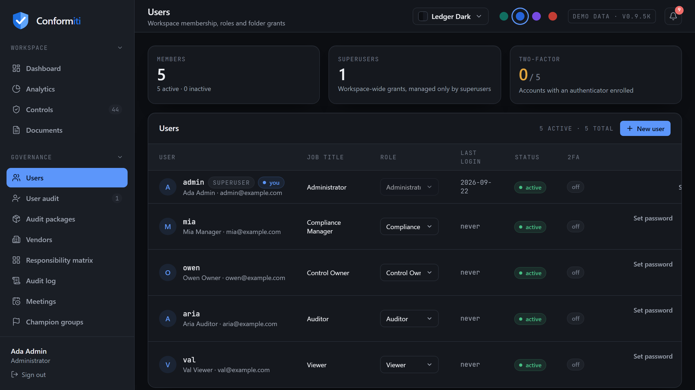
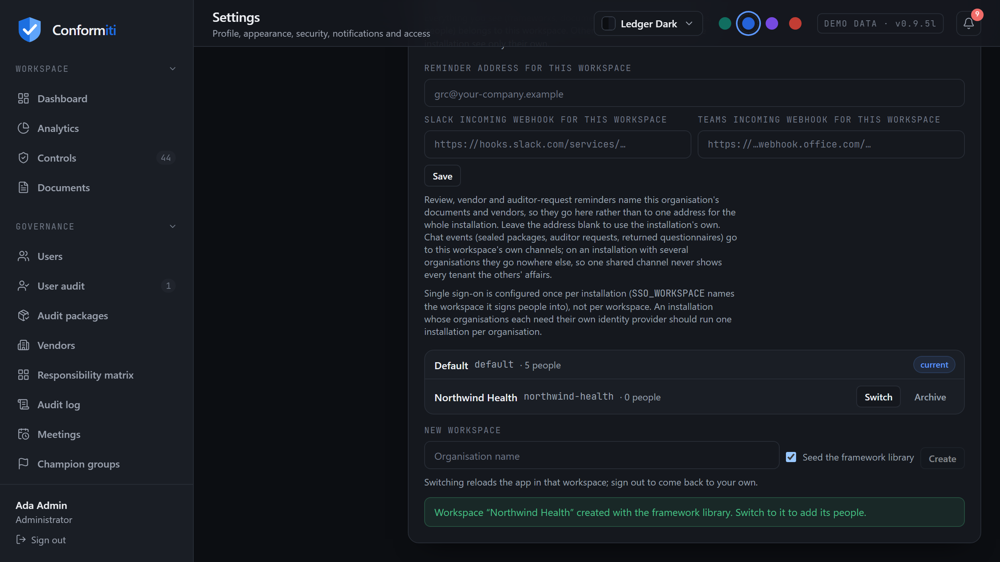
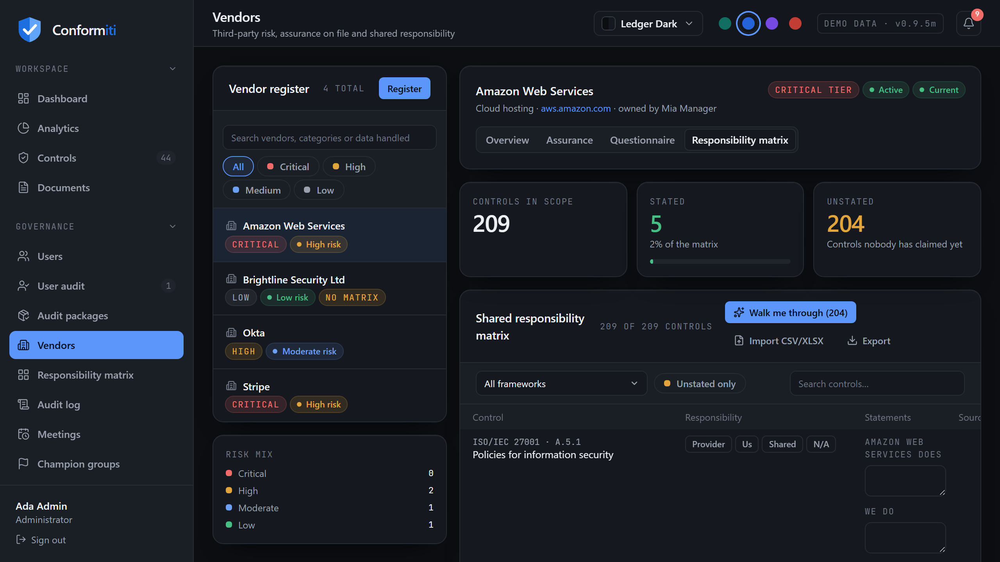
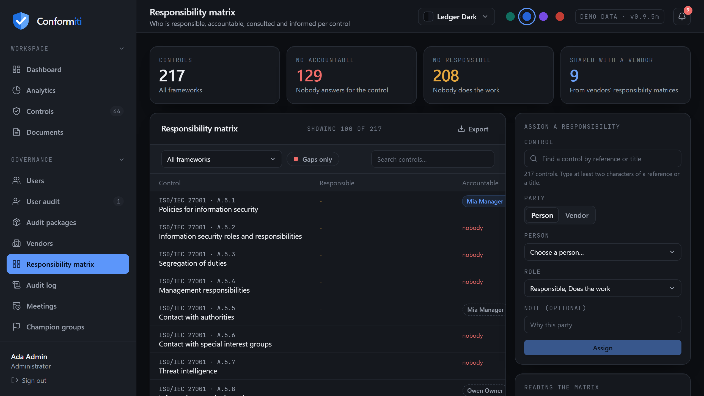
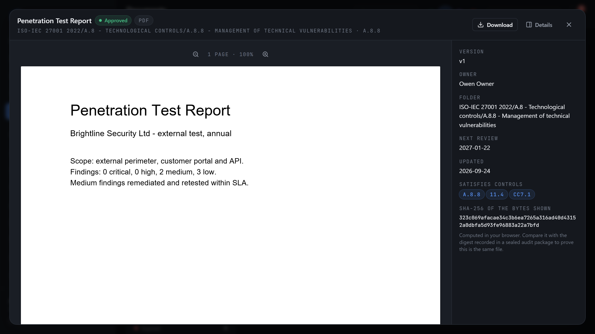
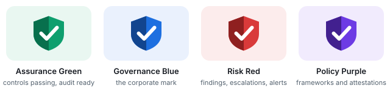
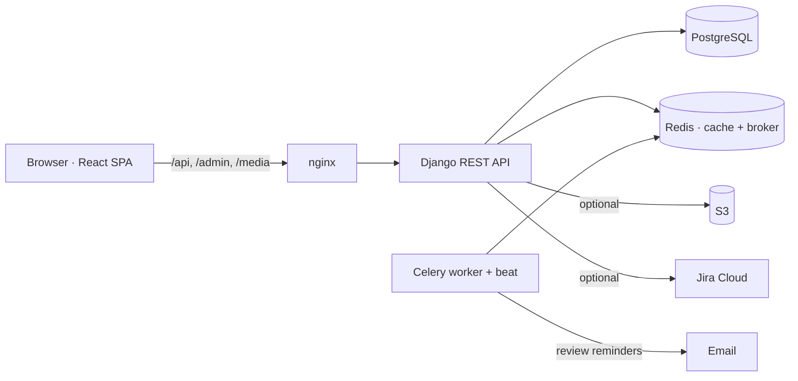

<div align="center">


**Self-hosted GRC for SOC 2, ISO/IEC 27001:2022 and PCI DSS v4.0.1 — controls, evidence, vendors, risk and access reviews in one audit-ready system, ending in a sealed package your assessor can verify without you.**

[](https://github.com/dboudreau00/Conformiti/actions/workflows/ci.yml)
[](CHANGELOG.md)
[](LICENSE)


[Install](#sixty-second-install) · [What it does](#what-you-get) · [Audit packages](#handing-evidence-to-an-auditor) · [Architecture](#architecture) · [Configuration](#configuration) · [Operations](#operations-runbook) · [conformiti.app](https://conformiti.app)


</div>

---

## Contents

<table>
<tr><td valign="top">

**Start here**
- [Sixty-second install](#sixty-second-install)
- [Why this exists](#why-this-exists)
- [What you get](#what-you-get)
- [Day one, in order](#day-one-in-order)

**The product**
- [Frameworks and controls](#frameworks-and-controls)
- [Documents and evidence](#documents-and-evidence)
- [Third parties and shared responsibility](#third-parties-and-shared-responsibility)
- [Governance](#governance)
- [Handing evidence to an auditor](#handing-evidence-to-an-auditor)
- [Security and access](#security-and-access)
- [Workspaces](#workspaces)
- [Notifications](#notifications)

</td><td valign="top">

**Running it**
- [Installation](#installation)
- [Configuration](#configuration)
- [Roles and permissions](#roles-and-permissions)
- [Operations runbook](#operations-runbook)
- [Upgrading](#upgrading)
- [Troubleshooting](#troubleshooting)

**Under the hood**
- [Tech stack](#tech-stack)
- [Architecture](#architecture)
- [The API](#the-api)
- [Quality gates](#quality-gates)
- [Project structure](#project-structure)

**Everything else**
- [FAQ](#faq)
- [Roadmap](#roadmap)
- [Contributing](#contributing)
- [Licence and legal notes](#licence-and-legal-notes)

</td></tr>
</table>

---

## Sixty-second install

```bash
git clone https://github.com/dboudreau00/Conformiti.git && cd Conformiti
docker compose up -d --build
```

Open **http://localhost:8080** and sign in as `admin`. The password is
generated on first boot and printed once:

```bash
docker compose logs backend | grep "Sign in as"
```

That is the whole install: PostgreSQL, Redis, the API, the reminder worker and
nginx come up with production-safe defaults — `DEBUG` off, a unique secret key
generated and persisted on first boot, rate limits in Redis shared across
workers, and the API published only on the host's loopback so the network
sees nothing but nginx. **No `.env` is required.**

Prefer a script that waits for the stack to report healthy and prints the URLs?

```bash
./install.sh --docker          # macOS / Linux / WSL
.\install.ps1 -Docker          # Windows PowerShell
```

Local development without Docker — SQLite, console email, nothing left running:

```bash
./install.sh                   # or: .\install.ps1
```

> **Before any real data goes in**, retire the demo accounts. The five demo
> personas share one password and none of them has a second factor.
>
> ```bash
> docker compose exec backend python manage.py createsuperuser
> docker compose exec backend python manage.py remove_demo_data
> ```
>
> Then set `SEED_DEMO_DATA=false` so it never comes back. Full sequence:
> [Day one, in order](#day-one-in-order).

---

## Why this exists

Most compliance programmes are held together by a control matrix in Excel, a
folder of policies nobody has opened since the last audit, and a heroic effort
in the six weeks before fieldwork. Three things reliably break:

| The question | What usually happens | What Conformiti does |
|---|---|---|
| *"Where is the evidence for CC6.1?"* | Somebody greps a shared drive | Evidence lives in a tree **generated from the control libraries**; every document declares which controls it satisfies, and every control lists its documents |
| *"When was this policy last reviewed?"* | 2023, and nobody noticed | Every document carries a cadence and a next-review date; owners are emailed at 30 / 14 / 7 / 1 days and once when overdue, each window sent exactly once |
| *"Just give the auditor read access to the drive"* | Access that outlives the engagement | A **sealed, signed package** issued to named auditors for a fixed window, that verifies offline and expires on its own |

Readiness is *measured*, not drawn: **implemented ÷ applicable**, snapshotted
daily, per framework. Nobody types a percentage into this system.

There is no telemetry, no phone-home, no licence server, and no seat meter in
the code. It is MIT, and it is meant to be run by the organisation that uses
it.

---

## What you get

<table>
  <tr>
    <td></td>
    <td></td>
  </tr>
  <tr>
    <td align="center"><sub>217 controls with inline status, owners and linked evidence</sub></td>
    <td align="center"><sub>Framework readiness, status mix, review load and ownership coverage</sub></td>
  </tr>
  <tr>
    <td></td>
    <td></td>
  </tr>
  <tr>
    <td align="center"><sub>Evidence tree segregated by control, review cadences, versions, grants</sub></td>
    <td align="center"><sub>5×5 risk register with treatment, owners, notes and CSV/XLSX import</sub></td>
  </tr>
  <tr>
    <td></td>
    <td></td>
  </tr>
  <tr>
    <td align="center"><sub>Periodic user access reviews exported as audit evidence</sub></td>
    <td align="center"><sub>Immutable trail of every change and sign-in</sub></td>
  </tr>
  <tr>
    <td></td>
    <td></td>
  </tr>
  <tr>
    <td align="center"><sub>Membership, roles, folder grants and who has an authenticator enrolled</sub></td>
    <td align="center"><sub>One installation serving several organisations, scoped at the ORM and switched by a superuser</sub></td>
  </tr>
  <tr>
    <td></td>
    <td></td>
  </tr>
  <tr>
    <td align="center"><sub>Vendors: assurance on file and a shared responsibility matrix, typed, prompted or imported</sub></td>
    <td align="center"><sub>RACI per control, for people and vendors, with the gaps counted</sub></td>
  </tr>
  <tr>
    <td></td>
    <td></td>
  </tr>
  <tr>
    <td align="center"><sub>PDF, image, Word and Excel evidence opened in the browser, with its digest</sub></td>
    <td align="center"><sub>Sealed evidence packages issued to a named auditor</sub></td>
  </tr>
</table>

### Frameworks and controls

- **Three complete control libraries** — SOC 2 (61), ISO/IEC 27001:2022 (93),
  PCI DSS v4.0.1 (63) — **217 controls**, with a cross-framework crosswalk,
  per-control status and owner, and a CSV export of the register.
- **Evidence ↔ control mapping in both directions.** One Access Control Policy
  can satisfy `CC6.1`, `A.5.15` and `7.1` at once; one control can cite many
  documents. Edit the link from either side; bulk-attach during audit prep, and
  the bulk action reports what it skipped and why.
- **A control owner is an account, not a text field.** That is what makes the
  ownership-coverage figure meaningful, what routes the reminder email, and
  what lets a control owner answer a PBC line without seeing the rest of the
  audit package.
- **Readiness that is measured.** Daily snapshots feed the dashboard trend and
  the month-over-month delta. Marking a control *not applicable* removes it
  from the denominator — and the justification is timestamped in the audit
  trail, which is exactly what an assessor asks for.

### Documents and evidence

- **A folder tree segregated by control**, generated from the libraries
  (framework → category → control), created on disk and mirrored in the app,
  with your own subfolders wherever you want them.
- **Per-folder grants** by role *or* by user at `view` / `edit` / `manage`,
  **inherited down the tree**. Effective access is resolved server-side; the
  interface only offers a write control where the API would accept the write.
- **Document lifecycle** — versions (the old file is archived, not
  overwritten), rename, move, mark-reviewed; review cadences from monthly to
  biennial.
- **Review reminders** emailed to owners and the compliance address at
  configurable lead times, and once when overdue (which also marks the document
  *expired*). Each window is recorded on the document, so a restart does not
  re-send yesterday's mail.
- **Malware scanning** of uploads when ClamAV is configured — new documents
  and new versions, form templates, meeting minutes — with a health probe, an
  outage alert, and an hourly re-scan sweep that quarantines a stored file the
  new definitions match.

#### Open in browser

Downloading evidence in order to look at it is how copies of your policies end
up in Downloads folders on laptops you do not control. The viewer renders in
place, and it is deliberately conservative:

| Type | How it is rendered |
|---|---|
| PDF | Drawn by **pdf.js** onto canvases. No plugin frame, no scripting from the file |
| Images | Streamed inline **only after a magic-byte check on the actual bytes** — never on the extension |
| Word, Excel | Parsed on the server into structured JSON and rendered as *structure*. The file's own markup never reaches the page |
| Anything else | Offered as a download rather than guessed at |

The wrapper shows the version, the controls the document satisfies, and a
**SHA-256 computed in your browser** with WebCrypto — the same digest a sealed
audit package records, so a reviewer can compare by eye.

### Third parties and shared responsibility

- **Vendor register** with tier, data handled, owner and a review clock;
  **assurance on file** — SOC 2 reports, ISO certificates, PCI AOCs, pen tests,
  DPAs, a copy of their own responsibility matrix — with expiry tracking.
  Posture and risk rating are **computed** from what is on file and how close
  it is to lapsing, not typed into a dropdown in 2024 and forgotten.
- **The questionnaire, sent to the vendor.** One click emails their contact a
  personal, time-boxed link (14 days by default, 90 maximum, one live link per
  vendor, revocable). They answer in a browser with **no account**; the token is
  stored hashed; the submission returns as a pending assessment marked
  *Returned by …* for you to accept, note exceptions against, or reject.
- **Shared responsibility matrix per vendor** — provider / customer / shared
  with a statement each side, over every control in scope. Type it, be walked
  through the unstated controls, or **import the vendor's own CSV/XLSX**: the
  importer scores headers to find the right columns, promotes a mark column by
  the values inside it, treats the vendor's name or acronym as the provider
  column, requires the framework to be *stated* rather than inferred, and
  **reports prose it does not recognise instead of guessing**. Nothing is
  written until you confirm what it read.
- **Export in their layout** — the stated matrix goes back to the vendor under
  the column headers of the file they sent you.
- **RACI matrix** per control for people *and* vendors, with the control owner
  as implied Accountable and a vendor's matrix as implied Responsible. Exactly
  one Accountable is enforced at the API, and the controls with none are
  counted and shown — that count is the point.
- **Onboarding prompts** in the notification tray when a vendor has no matrix,
  a report is about to lapse, or a review falls due — plus a **bridge-letter
  reminder**, in the tray and by email, when a SOC report has lapsed with
  nothing newer on file.

### Governance

- **Risk register** — likelihood × impact on the 5×5 grid auditors expect,
  with treatment, owner, due date, optional linked control and Jira key, and a
  note trail anyone with access can add to. CSV/XLSX import that recognises
  the column names and word scales people actually use (Title/Risk,
  Likelihood/Probability, Impact/Severity, *High*, *Likely*, *Almost
  certain*…) and skips duplicates by title. CSV export that round-trips.
- **User access reviews** — snapshot every account as it stands (role, last
  login, folder grants, capabilities) into a keep / modify / revoke decision
  grid, so it cannot shift under you while you work through it. The API refuses
  to complete a review while any row is pending; a completed review is
  read-only evidence from that moment.
- **Meeting cadences** with required-per-year tracking, where the status badge
  compares minutes recorded against what the calendar demands *so far* — a
  series is not marked behind in January for a meeting due in November.
- **Champion groups** with an accountable owner and members tagged by
  department.
- **Jira** (optional) — an administrator connects an Atlassian site (base URL,
  account email, API token, stored server-side and never sent to the browser)
  and tracks boards by id; everyone can then read those boards without a Jira
  seat. `https://` public hosts only, redirects refused, SSRF-hardened.
- **Immutable audit trail** — every change made through the API, plus
  sign-in, failed sign-in (with the reason) and sign-out, with actor, record,
  the field *names* submitted and the IP. Values are never recorded, and password/token/code keys are dropped
  before the entry is written. There is no endpoint that edits or deletes one.

### Security and access

- **TOTP two-factor auth** and **passkeys / security keys (WebAuthn)**, alone or
  together, with **backup codes owned by the account** so a passkey-only person
  still has a recovery path. A credential whose signature counter regresses
  looks cloned: Conformiti disables it and **refuses the sign-in** rather than
  dropping the account to password-only.
- **HttpOnly cookie sessions by default** with `__Host-` / `__Secure-` prefixes
  derived from the deployment, plus **rotating, revocable refresh tokens** and
  per-client login throttles shared across workers through Redis.
- **Single sign-on over OpenID Connect or SAML 2.0** (Okta, Entra ID, Google
  Workspace, Keycloak…), **configured from the environment only** — there is no
  form an attacker can reach. Verified-email linking never attaches to an
  administrator, staff or user-managing account; auto-provisioning refuses
  user-managing roles; a domain allow-list applies; the issuer is compared with
  trailing slashes stripped; JWKS verification is asymmetric only.
- **Step-up MFA on SSO logins** — `off`, `if_enrolled` or `required` — for when
  the provider asserted no second factor.
- **Five built-in roles** plus custom roles, folder-level grants, and an API
  that enforces every rule the UI shows.
- Security headers and CSP on by default; uploads size-capped, typed and served
  as sandboxed attachments; field-level encryption for the TOTP seed and the
  Jira token.

### Workspaces

One installation can serve several organisations. Everything an organisation
owns belongs to its **workspace**, and the scoping is applied **at the ORM** —
a queryset carries its workspace filter every time it is chained, so a view
that forgets to scope still cannot leak. A person from one organisation cannot
list, fetch or even reference another's rows.

- A superuser creates workspaces under *Settings › Role & access*, switches
  between them (`X-Workspace: <slug>`; the SPA remembers the choice) and
  **archives** one — which refuses its people at sign-in, rejects the tokens
  they already held for as long as it stays archived, and drops it from every
  scheduled job. Nothing is deleted.
- Scheduled work runs **once per workspace**: review, vendor and
  auditor-request scans, the daily chat summary, readiness snapshots. Digests
  are computed in the person's own workspace.
- A single-organisation install has one workspace called *Default* holding
  everything it already had, and never notices.
- **Not tenant-scoped, deliberately:** the workspace list itself, per-person
  authentication state (passkeys, TOTP, backup codes, SSO identities), the
  signing-key registry, the scanner status row, notification receipts and
  webhook deliveries. Those belong to the installation or to the individual.
- **Not yet per workspace:** the single sign-on provider (one IdP for the
  installation; `SSO_WORKSPACE` names the workspace it provisions into) and
  the Slack/Teams webhook (one channel, each post carrying the workspace name
  once there is more than one). Both are next on the roadmap.

### Notifications

- **The tray** is computed for *you*: documents and risks you own that are due
  or overdue, tasks assigned to you, meeting cadences you own that are behind.
  Managers get org-wide digests; administrators and auditors see open access
  reviews. Opening the tray marks items read; `×` dismisses one.
- **Slack and Microsoft Teams** by incoming webhook (`https` only, set by an
  operator and nowhere else): a package sealed, issued or withdrawn; the
  auditor raising a request or returning an answer; a vendor's questionnaire
  coming back; the malware scanner going quiet or recovering; a file
  quarantined; and a **daily summary** of what is outstanding. Slack receives
  Block Kit, Teams an Adaptive Card, and every delivery is logged.
- **Digest email** — each person can have their own tray sent daily or weekly.

### Interface and identity

Four theme packs (Audit Ledger, Nimbus, Ledger Dark, Obsidian), four accent
packs and a custom accent colour, applied before first paint and remembered per
browser. Keyboard-accessible throughout.

The mark is a shield split along its centreline with one check struck across
it, in four colourways with **fixed meanings**: **Governance Blue** is the
corporate mark; **Assurance Green** means controls passing and audit ready;
**Risk Red** is reserved for findings, escalations and alerts and is never the
lockup; **Policy Purple** stands for frameworks and attestations. Sources in
`assets/brand/` and `frontend/src/brand.js`.



---

## Handing evidence to an auditor

This is the feature the rest of the product exists to feed.

Audit time usually means granting an external assessor read access to a folder
tree and hoping somebody remembers to take it away afterwards. **Audit packages
replace that ritual.**

### The four steps

```
 ASSEMBLE ─────────▶ SEAL ─────────▶ ISSUE ─────────▶ VERIFY
 controls in scope   canonical       one named        sha256sum -c
 evidence pinned     manifest +      auditor, fixed   python3 verify.py
 population stated   Ed25519 sig     window           no vendor involved
 assertion written   audit entry     package only     signature checked offline
```

**1 · Assemble.** A compliance manager picks the controls in scope, pins the
evidence for each one, states each control's population (size, source,
sampling method) and may list the items, then writes the management assertion.

**2 · Seal.** Sealing snapshots every row — control reference and text, status,
owner, document name, version, size and SHA-256 — into a **canonical manifest**
with its own digest, and signs that manifest with a detached **Ed25519**
signature from a key held in a file *outside the database*
(`SIGNING_KEY_FILE`). The package freezes: the assessed organisation can no
longer change what the auditor is looking at. A seal entry goes into the audit
trail, and the key fingerprint is published under *Settings › About* and at
`/api/signing-keys/`.

**3 · Issue.** The package is issued to named auditors, each for a fixed period.
They sign in and see **that package and nothing else** — the only bypass of the
folder-permission model in the product, and a deliberate, audited one. They
record a **design** and an **operating** conclusion per control, which nobody
at the assessed organisation can edit, and you answer beside them with a
management response. An exception can be raised into the risk register in one
click, arriving with the package and control already referenced.

**4 · Verify.** They leave with one self-verifying ZIP:

```
conformiti-package-fy26-soc2/
├── manifest.json        canonical, one digest over everything
├── manifest.sig         detached Ed25519 signature
├── signing-key.pub      the public key, to compare against the published fingerprint
├── SHA256SUMS           every file, hashed
├── verify.py            standard library only — no pip install, no network
├── controls.csv         scope, status, owner, both conclusions
├── evidence.csv         name, version, size, digest
├── samples.csv          population, selections, per-item verdicts
├── audit-trail.csv      what happened, and when
└── evidence/            the files themselves
```

```bash
sha256sum -c SHA256SUMS
python3 verify.py
```

Access expires, or is withdrawn in one click. The record of what was disclosed,
to whom, and every file they opened, is permanent.

### Sampling

Operating effectiveness is tested on sampled items, so the package holds them.
The organisation states the population while the package is a draft and may
list items; those are sealed into the manifest with the artefact supporting
each one. After sealing, the auditor adds their own selections and records
**pass, exception or not tested** per item, with an exception note that is
required, not optional. The bundle carries the whole workpaper as
`samples.csv`.

### Roll-forward

Next year, roll the package forward: the same controls re-snapshotted as they
stand today with today's evidence pinned, the old package recorded as the
predecessor, and a **year-over-year** panel showing what entered or left scope,
which evidence was replaced, and which of last year's exceptions are still
open. The manifest names its predecessor, so a chain of engagements verifies
end to end.

### The PBC request list

The other half of the workflow: what the auditor has asked for. The auditor
raises lines from inside the package (or you transcribe the list they emailed);
each one is assigned, dated and chased — in the tray, by email, and in Slack or
Teams — and answered by attaching documents and marking it *provided*. The
auditor accepts it or returns it with a note. **A control owner with no package
access still sees and answers the lines assigned to them.**

### What the signature proves, and what it does not

> A signature proves that the holder of a key signed a manifest. It cannot
> prove the key was never stolen, and it cannot prove *when* it was signed.
>
> The seal entry in the audit trail, and a digest you publish out of band — an
> email to the assessor, a ticket, a signed message — are the other half of
> that binding. Keep the signing key off the database host, back it up
> separately, and publish the fingerprint where your auditor can compare it.


---

## Day one, in order

| # | Do this | Why |
|---|---|---|
| 1 | `docker compose up -d --build` | The stack comes up with production-safe defaults |
| 2 | `manage.py createsuperuser` | A real administrator that is not a demo persona |
| 3 | `manage.py remove_demo_data` (`--delete` to remove rather than deactivate) | The demo accounts share one password and have no second factor |
| 4 | Set `SEED_DEMO_DATA=false` | So it never comes back on a rebuild |
| 5 | Set `DJANGO_ALLOWED_HOSTS`, `CSRF_TRUSTED_ORIGINS`, `CORS_ALLOWED_ORIGINS`, `PUBLIC_URL` | The moment you leave `localhost`. `PUBLIC_URL` is what vendor-questionnaire links are built from |
| 6 | Put TLS in front and set `BEHIND_TLS=true` | Secure cookies, HTTPS redirect, `__Host-` prefixes — the prefix only works over https |
| 7 | Configure `EMAIL_PROVIDER`, then `manage.py test_mailbox --to you@example.com` | Reminders are half the product |
| 8 | Enrol a second factor on every account with a management capability | TOTP or passkeys; backup codes belong to the account |
| 9 | Back up the **secrets** volume | It holds `DJANGO_SECRET_KEY_FILE` *and* the package signing key |
| 10 | Restore from a backup once, into a scratch environment | An untested backup is a finding in most frameworks and a disaster in all of them |

---

## Installation

### Requirements

| Path | Needs |
|---|---|
| **Docker** (recommended) | Docker Engine 24+ with the Compose plugin. 2 vCPU / 4 GB RAM / 20 GB disk is comfortable |
| **Local** (trial, development) | Python 3.11–3.14, Node 20.19+ or 22.12+. SQLite, console email, nothing to run |
| **Production** | PostgreSQL 16, Redis 7, a TLS-terminating proxy, an SMTP/SES sender, a backup target |
| **Optional** | Amazon S3, ClamAV, an OIDC or SAML IdP, a Slack/Teams webhook, Jira Cloud |

Full detail: [PREREQUISITES.md](PREREQUISITES.md) · [INSTALL.md](INSTALL.md) ·
a guided first hour in [GETTING_STARTED.md](GETTING_STARTED.md).

### What comes up

Five containers, five volumes, **one published port**. The API listens on
loopback inside its own container and is unreachable except through nginx,
which also carries the CSP, the security headers and the 32 MB body cap.

```
browser ─▶ nginx (frontend, :8080) ─┬─▶ gunicorn (backend, 127.0.0.1:8000) ─▶ PostgreSQL
                                    │        ▲  healthcheck /api/health/    └─▶ Redis (cache + broker)
                                    ├─ /static, /media from shared volumes
                                    └─ CSP, security headers, 32 MB body cap
celery worker + beat ──────────────────────────────────────────────▶ Redis / PostgreSQL / email
volumes: pgdata · media · static · secrets · tree
```

> **Never add `Content-Disposition` in an `X-Accel` location.** nginx passes
> the upstream header through, so adding one produces *two* — and browsers
> refuse the response. The API owns that header. This is called out because it
> was a real bug between 0.3.0 and 0.5.0; if you customise `nginx.conf`, do not
> reintroduce it.

---

## Configuration

Everything is environment-driven. The compose file carries production-safe
defaults; `.env` overrides them. Every key is documented in
[`.env.example`](.env.example). The ones that matter most:

### Core

| Setting | Purpose |
|---|---|
| `DJANGO_DEBUG` | `false` in Docker by default; `true` only on the local dev path |
| `DJANGO_SECRET_KEY` / `DJANGO_SECRET_KEY_FILE` | A strong key, or a path where one is generated and persisted (compose uses the file form on the `secrets` volume) |
| `DJANGO_ALLOWED_HOSTS`, `CSRF_TRUSTED_ORIGINS`, `CORS_ALLOWED_ORIGINS` | Your real hostname(s) once you leave localhost. Getting these wrong is the most common cause of an install that runs but refuses logins |
| `BEHIND_TLS` | `true` once a TLS-terminating proxy sits in front of nginx |
| `PUBLIC_URL` | The base that vendor-questionnaire links are built from; falls back to the request `Origin`, which a dev proxy will rewrite |
| `ORGANISATION_NAME` | Your name in outbound email and on the page a vendor sees |
| `SEED_DEMO_DATA` | `false` to boot without the demo dataset |
| `DJANGO_SUPERUSER_USERNAME` / `_PASSWORD` | Create your first account on first boot |

### Data, storage and mail

| Setting | Purpose |
|---|---|
| `DATABASE_URL` | PostgreSQL in Docker and production; SQLite locally |
| `EMAIL_PROVIDER` | `console` · `smtp` · `mailbox` (IMAP/POP3 + SMTP, with a copy filed in Sent) · `ses` |
| `REVIEW_SCAN_HOUR`, `REVIEW_ALERT_LEAD_DAYS` | When the daily scan runs; how far ahead it warns (30, 14, 7, 1 by default) |
| `S3_*` | Optional Amazon S3 for evidence instead of the local filesystem |
| `MAX_UPLOAD_MB`, `PASSWORD_MIN_LENGTH`, `THROTTLE_LOGIN` | Upload cap (32 MB default), password policy, per-client login throttle |

### Identity

| Setting | Purpose |
|---|---|
| `OIDC_*` | Issuer, client id/secret, scopes, domain allow-list, auto-provisioning. PKCE; asymmetric JWKS verification only |
| `SAML_*` | IdP metadata, entity id, ACS URL, signing certificate. Assertions are replay-checked; HMAC signature methods are refused |
| `SSO_STEP_UP` | `off` · `if_enrolled` · `required` — whether an SSO sign-in must also present a local second factor |
| `SSO_WORKSPACE` | Which workspace an auto-provisioned SSO account joins (default `default`) |
| `WEBAUTHN_RP_ID`, `WEBAUTHN_ORIGINS`, `WEBAUTHN_RP_NAME`, `WEBAUTHN_USER_VERIFICATION` | **`RP_ID` must be a domain** — browsers refuse an IP address, including `127.0.0.1`. Pin both when a proxy rewrites `Host` |

### Assurance and alerting

| Setting | Purpose |
|---|---|
| `SIGNING_KEY_FILE` / `SIGNING_KEY` | Where the Ed25519 package-signing key lives. In compose: `/app/secrets/package_signing_key`. Rotate with `manage.py rotate_signing_key` |
| `CLAMAV_*` | Point at a clamd instance to scan uploads, with a health probe, an outage alert and an hourly re-scan sweep |
| `SLACK_WEBHOOK_URL`, `TEAMS_WEBHOOK_URL` | Incoming webhooks, `https` only, set by an operator and nowhere else |

---

## Roles and permissions

| Role | Manage users | Manage frameworks | Manage documents | Manage folders | View all | Auditor |
|---|:-:|:-:|:-:|:-:|:-:|:-:|
| Administrator | ✓ | ✓ | ✓ | ✓ | ✓ | – |
| Compliance Manager | – | ✓ | ✓ | ✓ | ✓ | – |
| Control Owner | – | – | ✓ (granted folders) | – | – | – |
| Auditor | – | – | – | – | ✓ (granted folders, read-only) | ✓ |
| Viewer | – | – | – | – | – | – |

Custom roles are defined from the same capability flags.

**Effective folder access** — `Folder.effective_access(user)` returns the
highest of:

1. `manage` if superuser or `role.can_manage_folders`
2. `view` if `role.can_view_all`
3. `manage` if the user owns the folder
4. the strongest `FolderPermission` for the user or their role on **this folder
   or any ancestor** (inheritance)

…then an Auditor role is capped at `view`. Documents inherit their folder's
access; a document owner may always *edit* their own document, but deleting it
requires `manage` on the folder. Re-parenting requires `manage` on the folder
and `edit` on the destination; the generated framework folders are immutable
through the API.

`documents.access.accessible_folder_ids(user)` resolves the same rules in a
handful of queries and scopes every list, tree, feed, evidence count and
analytics figure.

Demo accounts (retire them): `admin`, `mia`, `owen`, `aria`, `val` — all
the password printed when the demo data was seeded.

---

## Operations runbook

Prefix each command with `docker compose exec backend python` on the Docker
path, or `../.venv/bin/python` from `backend/` locally.

### Scheduled — once per workspace

In Docker, Celery beat runs all of this. Without Docker, put them on cron.

```bash
manage.py send_review_reminders [--dry-run]   # the review/document scan
manage.py record_readiness                    # today's readiness snapshot
manage.py scan_evidence                       # re-scan sweep + scanner watch
manage.py send_digests                        # per-person daily/weekly digest
manage.py flushexpiredtokens                  # prune the JWT blacklist
```

`--dry-run` prints what the scan *would* send without sending it — worth
running once after any mail configuration change.

### Administration

```bash
manage.py createsuperuser
manage.py seed_frameworks --with-folders          # idempotent; re-sync after an upgrade
manage.py seed_frameworks --roles-only
manage.py remove_demo_data [--delete] [--workspace <slug>]
manage.py rotate_signing_key                      # new Ed25519 key; old public key stays published
manage.py link_oidc_identity
manage.py test_mailbox --to you@example.com
```

### Backup — three things, all of them

```bash
# 1 · the database
docker compose exec -T db pg_dump -U conformiti conformiti | gzip > db.sql.gz

# 2 · the evidence files (a database without these is a manifest of things you no longer have)
docker run --rm -v conformiti_media:/m -v "$PWD:/out" alpine tar czf /out/media.tgz -C /m .

# 3 · the secrets volume — DJANGO_SECRET_KEY_FILE and the package signing key
docker run --rm -v conformiti_secrets:/s -v "$PWD:/out" alpine tar czf /out/secrets.tgz -C /s .
```

Losing the signing key does **not** invalidate signatures already issued — the
public key travels in every bundle — but you will not be able to sign with the
same identity again, and roll-forward chains will change key.

### Health

`GET /api/health/` reports version, database, cache, mail, scanner and signing
status. It is what the container healthcheck uses, and the first thing to
attach to a bug report.

---

## Upgrading

Semantic versioning. Upgrade notes for each release — including migration
counts and what to budget for them — are in [CHANGELOG.md](CHANGELOG.md).

```bash
# back up first (see above)
git fetch --tags && git checkout v0.9.0
docker compose pull && docker compose up -d --build
docker compose exec backend python manage.py migrate
docker compose exec backend python manage.py seed_frameworks --with-folders
```

**0.9.0 in particular** is ten migrations, one per app. Each adds the workspace
column, moves every row into the *Default* workspace, and then makes the column
required — inside one transaction on PostgreSQL. Budget a few seconds per
hundred thousand rows.

---

## Tech stack

| Layer | Technology |
|---|---|
| **Backend** | Python 3.11–3.14 · Django 5.2 LTS · Django REST Framework · SimpleJWT |
| **Async** | Celery 5 + Redis — daily reminder scan, vendor and PBC scans, readiness snapshot and chat summary (each once per workspace), digest emails, hourly scanner watch, weekly token pruning |
| **Frontend** | React 19 · React Router 7 · Vite 8 · Tailwind CSS · framer-motion · lucide · pdfjs-dist |
| **Database** | SQLite (local) · PostgreSQL 16 (Docker / production) |
| **Storage** | Local filesystem · Amazon S3 optional |
| **Email** | Console · SMTP · IMAP/POP3 mailbox account · Amazon SES |
| **Crypto** | Ed25519 manifest signatures; a from-scratch, standard-library verifier tested against RFC 8032 vectors |



---

## Architecture

Deeper notes: [docs/ARCHITECTURE.md](docs/ARCHITECTURE.md).

### Apps

| App | Responsibility |
|---|---|
| `accounts` | Custom `User`, `Role` (capability flags), RBAC permission classes, TOTP MFA + backup codes, passkeys (`webauthn.py` protocol, `passkeys.py` glue), OIDC and SAML SSO, workspaces and the tenancy machinery, sign-out, demo retirement, blacklist pruning |
| `compliance` | `Framework`, `ControlCategory`, `Control`, `ControlMapping` (crosswalk), `ControlEvidence`, `Responsibility` (RACI), the seed and on-disk folder tree, controls CSV export |
| `documents` | `Folder` (self-parent tree with a cycle guard), `FolderPermission`, `Document` (+ scan verdict / quarantine), `DocumentVersion`, upload validation, the clamd client, the scanning boundary and the scanner watch, `preview.py` |
| `governance` | `Risk` + `RiskNote` (+ the CSV/XLSX importer), `AccessReview` + snapshot items, `MeetingSeries` + minutes, `ChampionGroup` + members |
| `vendors` | `Vendor`, `VendorAssessment`, `SharedResponsibility` + the CSV/XLSX recogniser (`matrix.py`), `QuestionnaireInvite` and the public token endpoints |
| `attestations` | `EvidencePackage` → `PackageControl` → `PackageEvidence` / `PackageSample`, `PackageGrant` (the audited folder-permission bypass), manifest and bundle, `PbcRequest` / `PbcItem`, roll-forward and the year-over-year diff, Ed25519 signing and the `SigningKey` registry, the stdlib `verifier.py` shipped in every bundle |
| `notifications` | Reminder scans, email transports, the derived per-user feed with receipts, digest emails, Slack/Teams webhooks with a delivery log |
| `audit` | `AuditLog`, the request middleware, explicit auth events, a read-only viewer API |
| `analytics` | The dashboard summary endpoint, `ReadinessSnapshot` history and trend |
| `calendar_app` | `CalendarEvent` plus the merged review / audit / task feed |
| `integrations` | The Jira Cloud client — https-only, public-IP pinned, no redirects |
| `config` | Settings, URLs, the health endpoint, the version, the CSV sanitiser |

### Data model, in essence

```
Framework 1─* ControlCategory 1─* Control *─* ControlMapping
                                    │ 1─* ControlEvidence *─1 Document
User(Role) ─owns→ Control / Folder / Document / Risk

Folder (self-parent tree; framework/category/control FKs on seeded nodes)
   │ 1─* Document 1─* DocumentVersion
   │        └─ owner, review_cadence, next_review_date, reminders_sent,
   │           scan verdict / quarantine
   └─ FolderPermission (role|user → view/edit/manage, inherited downward)

Risk 1─* RiskNote                 AccessReview 1─* AccessReviewItem (snapshot)
MeetingSeries 1─* MeetingMinute   ChampionGroup 1─* GroupMember
CalendarEvent → optional Document / Control / assignee

Vendor 1─* VendorAssessment
   ├─ 1─* SharedResponsibility    (the provider/customer/shared matrix)
   ├─ 1─* Responsibility          (RACI rows — note: a different relation)
   └─ 1─* QuestionnaireInvite     (token hash only)

EvidencePackage 1─* PackageControl 1─┬─* PackageEvidence
                                     └─* PackageSample
   ├─ 1─* PackageGrant             (the audited bypass)
   ├─ 1─* PbcRequest 1─* PbcItem
   └─ prior_package → the roll-forward chain

AuditLog · ReadinessSnapshot (one per day) · NotificationReceipt (user, key)
MfaDevice 1─* MfaBackupCode · WebAuthnCredential · SigningKey · WebhookDelivery

every organisation-owned model above → workspace_id
```

> `Vendor.responsibilities` are the **RACI rows**; the shared-responsibility
> matrix rows are `Vendor.shared_responsibilities`. Confusing the two makes
> every vendor look unstated.

### Tenancy

`accounts.Workspace` is the tenant. Every organisation-owned model inherits
`accounts.tenancy.TenantModel`: a `workspace` foreign key and a manager whose
querysets carry `WHERE workspace_id = <active>` whenever a workspace is active.
The active workspace is a context variable.

- `WorkspaceMiddleware` installs a per-request resolver that reads the workspace
  off the authenticated person the *first time a tenant query runs* — DRF
  authenticates inside the view, after middleware, so it has to be lazy. A
  superuser may name another workspace in `X-Workspace`. The variable is
  restored when the request ends.
- Tasks and commands activate one with `tenancy.scoped(ws)` and walk them all
  with `tenancy.for_each_workspace()`.
- A row saved without a workspace takes it from its declared parent
  (`tenant_parent = "folder"`) or from the active workspace, and refuses
  otherwise (`NoActiveWorkspace`).
- The filter is re-applied whenever a queryset is chained, so a queryset built
  at import time (`queryset = Model.objects.all()` on a viewset) is scoped the
  moment DRF calls `.all()`. **Pinning never widens.**
- No active workspace means no filter — right for migrations,
  `createsuperuser`, and jobs that walk every workspace. An API request with
  nowhere to go is refused with 403. `tenancy.unscoped()` is the explicit
  escape hatch.

### Authentication

- `POST /api/auth/token/` → access (60 min) + refresh (7 d). Accounts with a
  second factor get `{"mfa_required": true, "factors": {...}, "passkey"?: {...}}`
  until an `otp` (authenticator or backup code) or a `passkey` assertion is
  supplied; passkey challenges live in `WebAuthnChallenge` rows that answer
  once.
- `POST /api/auth/token/refresh/` rotates the refresh token and blacklists the
  old one; `POST /api/auth/logout/` blacklists the current one.
- Session auth remains for the Django admin and, in `DEBUG`, the browsable API.
- Login, failed login (with reason) and logout are audit events.

### Review-alert flow

```
Document.last_reviewed + cadence ─▶ next_review_date
        │
   daily scan at REVIEW_SCAN_HOUR (Celery beat) — or cron: send_review_reminders
        │
   for each lead in REVIEW_ALERT_LEAD_DAYS (30,14,7,1) not yet sent:
        └▶ email_service.send_templated_email()
              ├─ EMAIL_PROVIDER=ses     → boto3
              ├─ EMAIL_PROVIDER=mailbox → SMTP (+ IMAP Sent copy)
              ├─ EMAIL_PROVIDER=smtp    → Django SMTP backend
              └─ EMAIL_PROVIDER=console → stdout
        │
   record the lead in Document.reminders_sent (dedupe)
   overdue → one notice + status=expired
```

### Audit trail

`audit.middleware.AuditLogMiddleware` reads the top-level field *names* of a
JSON/form body **before** the view runs — values are never recorded, and
password, token and code keys are dropped — then, after a successful mutating
response, writes `{user, action, object_type, object_id, "METHOD /path
fields=a,b", ip}`. `/api/auth/*`, `/api/notifications/*` and `/api/health/` are
excluded; auth events are written explicitly by `audit.events`.

### Frontend

A React SPA on Vite. `App.jsx` mounts the shell (`Sidebar`, `TopBar`,
`ShellContext` with the signed-in user, health record and live badge counts)
and the routes; every page is a `PanelTransition` panel built from the
primitives in `components/ui` and `components/charts`. Styling is Tailwind over
the token system in `styles/index.css`: a theme pack (`data-theme`) and an
accent pack or custom colour (`data-accent`) on `<html>`, applied before first
paint by `public/theme-init.js`. The axios client attaches the access token,
refreshes once on 401 (storing the rotated refresh token) and revokes on
sign-out.

---

## The API

Django REST Framework, with the SPA as its first consumer. Anything the
interface can do, a script can do — under the same permission checks, and
writing the same audit-trail entries.

| Endpoint | Purpose |
|---|---|
| `/api/frameworks/` · `/api/controls/` | The libraries, statuses, owners, the crosswalk, CSV export |
| `/api/folders/` · `/api/documents/` | The evidence tree, uploads, versions, review marking, permission grants |
| `/api/documents/{id}/preview/` | Grant-gated, audited render for the in-browser viewer |
| `/api/risks/` · `/api/risk-notes/` | The register, the note trail, the CSV/XLSX importer |
| `/api/access-reviews/` | Snapshot creation, per-row decisions, CSV export, completion |
| `/api/vendors/` | Register and assessments; `/{id}/matrix/` GET, PUT (bulk, validated before write), `matrix/parse`, `matrix/export` |
| `/api/questionnaire/<token>/` | Public, token-scoped, separately throttled — what a vendor answers with no account |
| `/api/packages/` · `/api/package-samples/` | Assembly, sealing, issuing, withdrawal, manifest, bundle, per-sample verdicts |
| `/api/pbc-requests/` · `/api/pbc-items/` | The auditor's request list: provide, accept, return, withdraw, export |
| `/api/signing-keys/` | Published Ed25519 public keys and fingerprints |
| `/api/workspaces/` | List, create, patch, `current` |
| `/api/audit/` · `/api/notifications/` · `/api/analytics/` | The read-only trail, the derived feed with receipts, the dashboard summary |
| `/api/health/` | Version, database, cache, mail, scanner, signing |

Every list is scoped to the caller's workspace **and** their folder grants at
the queryset level, so a view that forgets to filter cannot leak.

---

## Quality gates

Everything in the badge row runs on every push. You can run the whole thing
locally:

```bash
./install.sh --test        # or: .\install.ps1 -Test
```

| Gate | What it proves |
|---|---|
| `tools/validate.py` — **17 static checks** | App and route wiring, the API contract between the SPA and the backend, that every model change has a shipped migration, theme packs, tests and CI present. Runs on a **bare Python interpreter** so a missing package cannot defeat it |
| `manage.py test` — **467 tests across 29 modules** | Workspace isolation, auth, MFA, token rotation, RBAC and tree integrity, evidence RBAC, access reviews, risk import/export safety, the audit trail, reminder dedupe, health, demo retirement, the boot guard, WebAuthn against virtual authenticators, SAML against locally signed assertions, Ed25519 against RFC 8032 vectors |
| Backend matrix | Python 3.11 / 3.12 / 3.13 / 3.14 on SQLite, plus PostgreSQL 16 |
| Frontend | A production build that must succeed, plus `npm audit --audit-level=high` |
| Docker | Both images build; the API image boots and answers `/api/health/` |
| [End-to-end](e2e/README.md) — **86 specs in 13 files** | Playwright drives the **built** SPA in a real browser through every screen, against *both* auth transports — and fails on any console error |

The review that produced this release — findings, severities, fixes and what
was deliberately left alone — is in [REVIEW.md](REVIEW.md). Operator-facing
posture and residual risks: [SECURITY.md](SECURITY.md). How the gates run:
[TESTING.md](TESTING.md) and [VALIDATION.md](VALIDATION.md).

---

## Troubleshooting

<details>
<summary><strong>The site loads but I cannot sign in</strong></summary>

Almost always `DJANGO_ALLOWED_HOSTS`, `CSRF_TRUSTED_ORIGINS` or
`CORS_ALLOWED_ORIGINS` not listing the hostname you are actually using —
including scheme and port. The backend log names the header it rejected. Behind
a proxy, confirm it forwards `Host` and `X-Forwarded-Proto`.
</details>

<details>
<summary><strong>Downloads fail, or the browser refuses the file</strong></summary>

Check that nothing adds a `Content-Disposition` header in the
`/protected-media/` nginx location. Django sets it upstream and nginx passes it
through; adding one produces two headers, and browsers refuse the response.
</details>

<details>
<summary><strong>Passkeys will not enrol or verify</strong></summary>

`WEBAUTHN_RP_ID` must be a domain name — browsers refuse an IP address,
including `127.0.0.1`. Use `localhost` for local work and set
`WEBAUTHN_ORIGINS` to match exactly, port included. If a proxy rewrites `Host`,
pin both values rather than letting them be derived.
</details>

<details>
<summary><strong>Reminder emails are not arriving</strong></summary>

`manage.py send_review_reminders --dry-run` shows what the scan believes is
due; `manage.py test_mailbox --to you@example.com` tests the transport
separately. Each lead window is sent once and recorded on the document — a
second run will not re-send yesterday's mail, which is correct and often
mistaken for a failure.
</details>

<details>
<summary><strong>Everything returns 403 after upgrading to 0.9.0</strong></summary>

An account with no workspace cannot make API requests. A superuser created by
`createsuperuser` lands in the first active workspace automatically; anyone
else in that position is refused with 403 by design. Assign the account a
workspace under *Settings › Role & access*, or re-run the migration if it did
not complete.
</details>

<details>
<summary><strong>A file is stuck in quarantine</strong></summary>

The re-scan sweep quarantines a stored file when updated definitions match it.
That is intended, and the file is not deleted. Check the scanner status row and
the notification; if it is a false positive the file can be released, and the
release is an audit-log entry with your name on it.
</details>

<details>
<summary><strong>A PDF renders blank</strong></summary>

Do not add a `sandbox` attribute to the PDF frame — Chromium disables plugins
and renders blank. PDFs are drawn by pdf.js onto canvases; the viewer must
fetch through the API client and render from a blob, never point a frame at the
media URL.
</details>

---

## Project structure

```
conformiti/
├── backend/            Django project (config/) + apps: accounts, compliance,
│                       documents, governance, vendors, attestations, notifications,
│                       audit, analytics, calendar_app, integrations
│                       · testutils.py · Dockerfile · entrypoint.sh
├── frontend/           React SPA (src/pages, src/components, src/styles)
│                       · brand.js · Dockerfile · nginx.conf
├── e2e/                Playwright suite — 13 spec files, both auth transports
├── compliance-data/    the generated evidence folder tree (segregated by control)
├── docs/               ARCHITECTURE.md · EXECUTIVE_SUMMARY.txt · SHAREPOINT_INTEGRATION.md
│                       · sample-risk-import.csv
├── assets/             brand/ (logo, mark, colourways) · screenshots/
├── tools/validate.py   the dependency-free static validator
├── .github/workflows   CI
├── docker-compose.yml  db · redis · backend · worker · frontend
└── install.sh / install.ps1
```

Documents in the root: [INSTALL.md](INSTALL.md) ·
[PREREQUISITES.md](PREREQUISITES.md) ·
[GETTING_STARTED.md](GETTING_STARTED.md) · [USER_GUIDE.md](USER_GUIDE.md) ·
[SECURITY.md](SECURITY.md) · [REVIEW.md](REVIEW.md) · [TESTING.md](TESTING.md) ·
[VALIDATION.md](VALIDATION.md) · [CHANGELOG.md](CHANGELOG.md) ·
[ROADMAP.md](ROADMAP.md) · [CONTRIBUTING.md](CONTRIBUTING.md)

---

## FAQ

<details>
<summary><strong>Will an auditor accept evidence from a tool I host myself?</strong></summary>

Auditors accept evidence; the tool is not the evidence. What matters is that
the artefact is attributable, complete and unaltered between the moment you
produced it and the moment they read it. A sealed package carries a canonical
manifest, a SHA-256 for every file, an Ed25519 signature over the manifest, an
audit-trail extract, and a standard-library `verify.py` the auditor runs on
their own machine. That is a stronger chain of custody than a shared folder.

Tell your assessor early that you will hand them a bundle rather than drive
access — most welcome it, and the ones who do not can still read the CSVs.
</details>

<details>
<summary><strong>Does it generate policies with AI?</strong></summary>

No, deliberately. Conformiti ships control libraries, an evidence model and the
machinery to prove what you did. It does not generate policy text you would
then have to defend in a walkthrough as your own.
</details>

<details>
<summary><strong>How small a team is this useful for?</strong></summary>

The smallest useful deployment is one person preparing for a first SOC 2 Type
I — the folder tree and reminder engine pay for themselves immediately. It
scales up through a compliance function with control owners spread across
engineering, HR and finance, and up again through workspaces to an MSP or a
group holding several regulated entities on one installation.
</details>

<details>
<summary><strong>Which frameworks ship, and what about the others?</strong></summary>

SOC 2, ISO/IEC 27001:2022 and PCI DSS v4.0.1 ship in this repository, free,
with a crosswalk between them. Additional framework libraries — NIST CSF 2.0,
HIPAA, CIS Controls v8 and others — are on the roadmap as seed packs, and can
also be commissioned as a supported package through
[conformiti.app](https://conformiti.app/consulting.html#seed-packs). A custom
control set can be modelled the same way.
</details>

<details>
<summary><strong>Can I get my data out?</strong></summary>

It was never anywhere else: a PostgreSQL database and a directory of files,
both yours. Nothing in this repository calls home, and every export in the
product — controls CSV, risk CSV, access-review CSV, the audit package bundle —
is a plain file format.
</details>

<details>
<summary><strong>Is there commercial support?</strong></summary>

Yes — support subscriptions, a managed cloud, and consulting are offered at
[conformiti.app](https://conformiti.app). None of it changes this repository:
the platform here is the platform there.
</details>

---

## Roadmap

Shipped through **0.9.0** (workspaces). Highlights of what is next, from
[ROADMAP.md](ROADMAP.md):

| Item | Why |
|---|---|
| Per-workspace single sign-on | One IdP per organisation rather than one per installation (`SSO_WORKSPACE` today) |
| Workspace-scoped chat channels | A Slack/Teams webhook per organisation rather than one shared channel with a prefix |

**Later:** automated evidence collection from cloud and SaaS (AWS, GitHub,
Okta, Google Workspace) with continuous control tests — and, with it, pulling a
provider's published responsibility matrix straight into the vendor record.
Parked until there are accounts to test it against properly, rather than
shipped half-working. Additional frameworks (NIST CSF 2.0, HIPAA, CIS Controls
v8) as seed packs.

---

## Contributing

See [CONTRIBUTING.md](CONTRIBUTING.md). In short:

- Run the gates before opening a pull request: `./install.sh --test`.
- New models need a shipped migration — `tools/validate.py` will fail the build
  otherwise, and it runs on a bare interpreter so it cannot be skipped.
- Validator checks must be **standard library only**; the CI `validate` job
  installs nothing.
- Security issues go to the private advisory route, not a public issue — see
  [SECURITY.md](SECURITY.md).

---

## Licence and legal notes

[MIT](LICENSE) © 2026 elemosecurity.

> **Control text and copyright.** Control identifiers and short titles are
> functional identifiers. The `objective` fields shipped in the seed packs are
> brief **original paraphrases**, not the normative text of SOC 2, ISO/IEC
> 27001 or PCI DSS. Only paste official control text into the app if your
> organisation holds a licence for the source documents — the field exists so
> that you can, and the responsibility is yours.

> **Not affiliated** with the AICPA, ISO, the IEC or the PCI Security Standards
> Council. Framework names are used to describe what the control libraries
> cover.

<div align="center">

**[conformiti.app](https://conformiti.app)** · [Product tour](https://conformiti.app/product.html) · [Self-hosting guide](https://conformiti.app/self-host.html) · [Security](https://conformiti.app/security.html)

</div>
