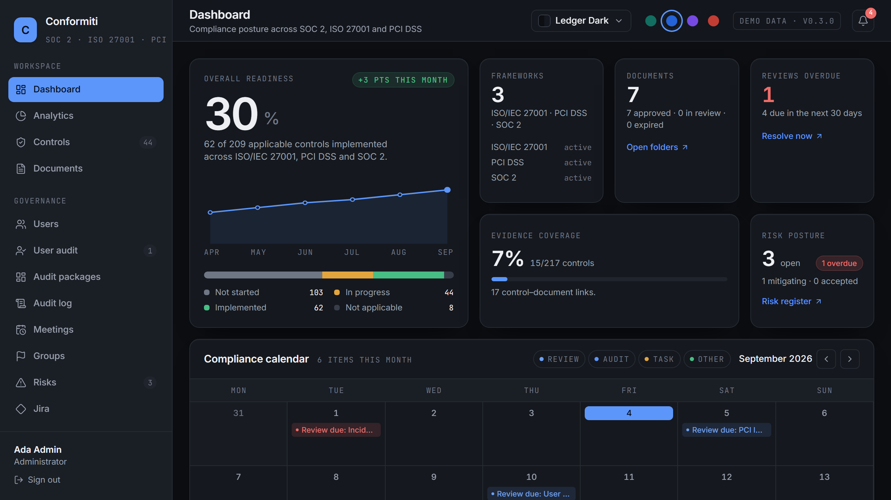
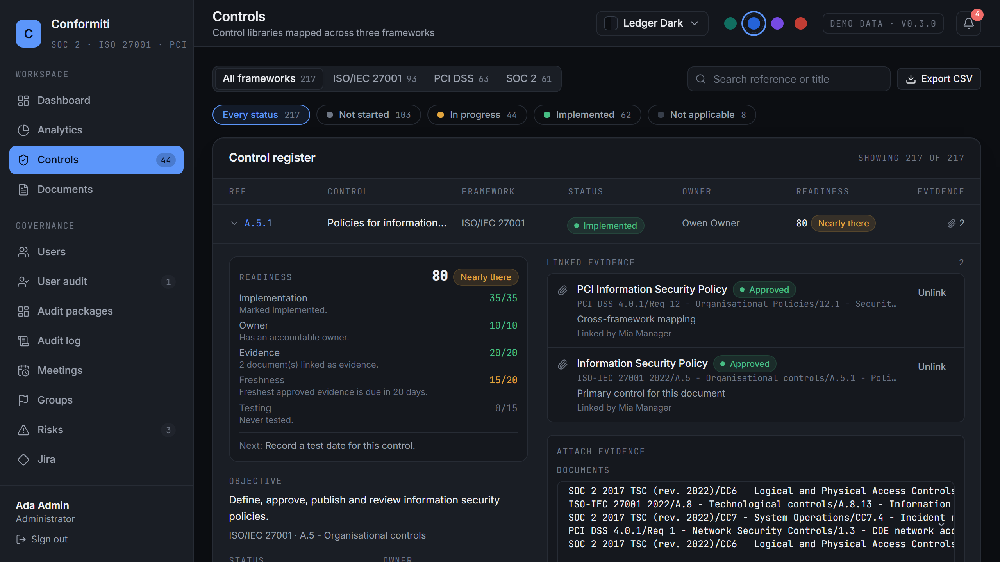
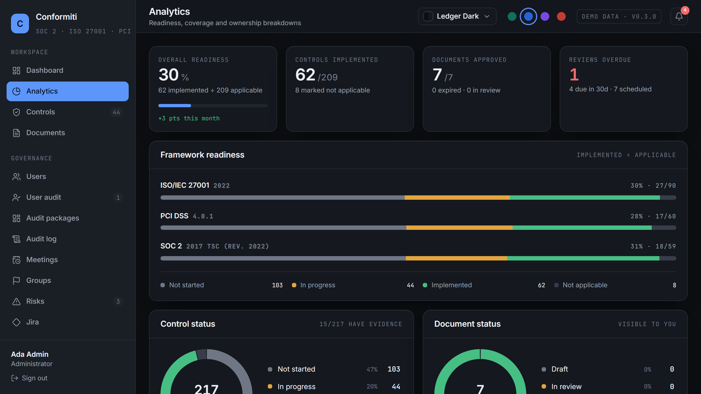
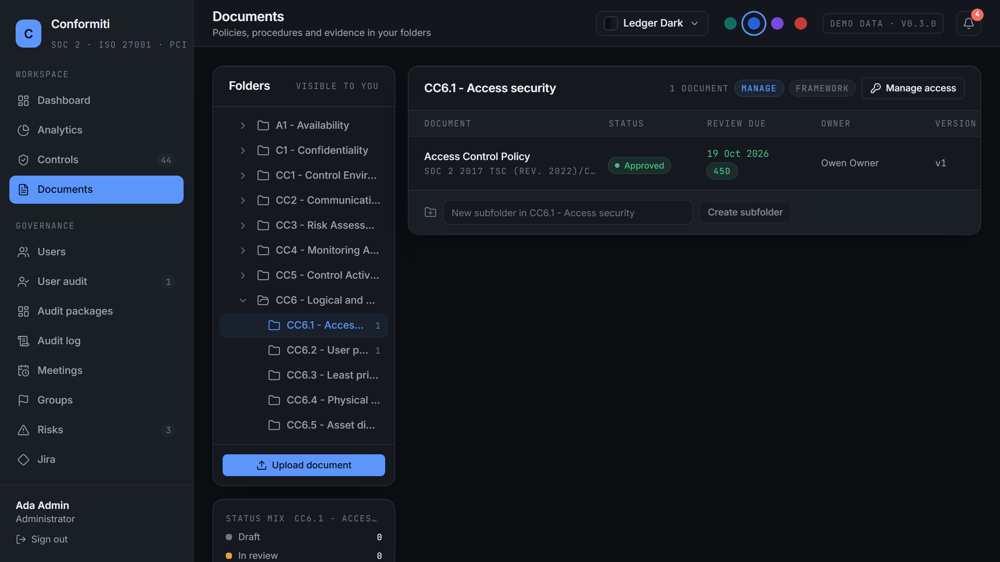
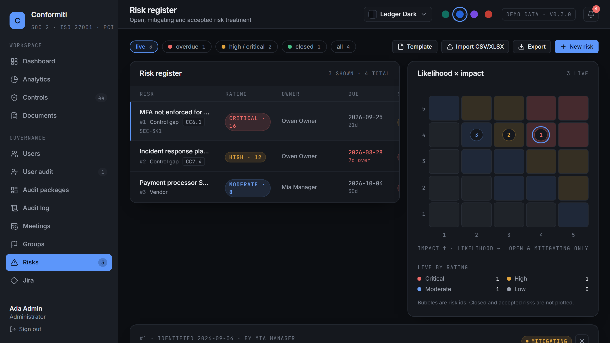
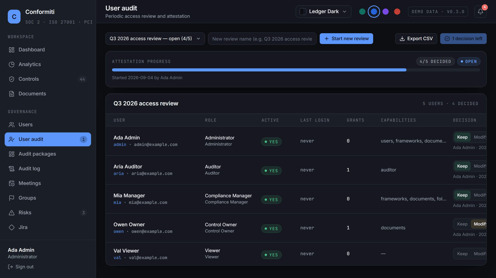
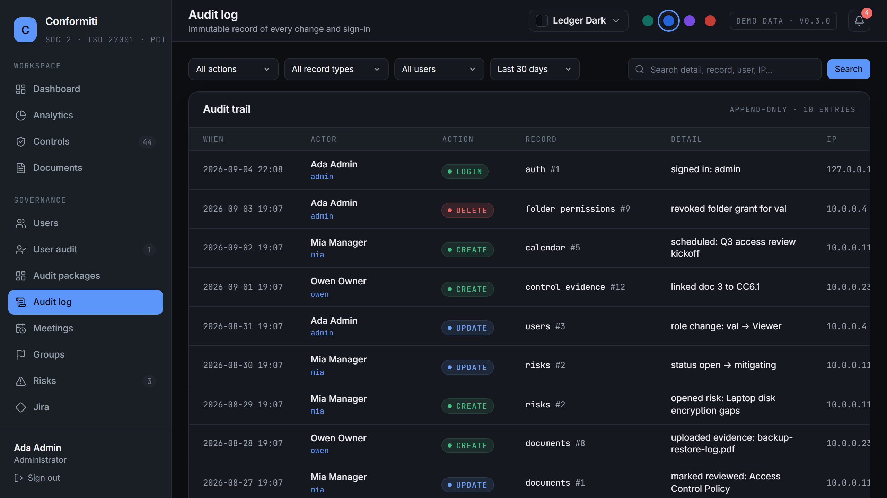
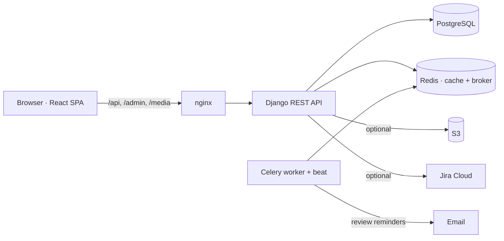
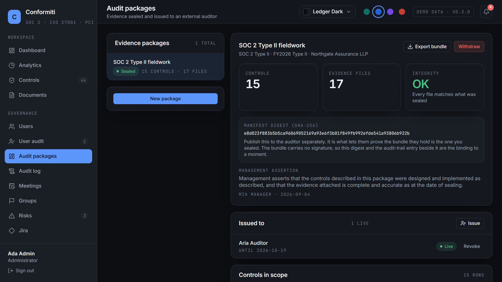

<div align="center">

# Conformiti

**Self-hosted GRC for SOC 2, ISO/IEC 27001:2022 and PCI DSS v4.0.1 — controls, evidence, documents, risks and access reviews in one audit-ready workspace.**

[](https://github.com/dboudreau00/Conformiti/actions/workflows/ci.yml)
[](CHANGELOG.md)
[](LICENSE)




</div>

---

## Sixty-second install

```bash
git clone https://github.com/dboudreau00/Conformiti.git && cd Conformiti
docker compose up -d --build
```

Open **http://localhost:8080** and sign in as `admin` / `DemoPass123!`.
That is the whole install: PostgreSQL, Redis, the API, the reminder worker and
nginx come up with production-safe defaults (DEBUG off, a unique secret key
generated on first boot, rate limits in Redis, the API reachable only through
nginx). No `.env` is required.

Prefer a script that also waits for the stack to report healthy and prints the
URLs?

```bash
./install.sh --docker          # macOS / Linux / WSL
.\install.ps1 -Docker          # Windows PowerShell
```

Before real use, retire the demo accounts:

```bash
docker compose exec backend python manage.py createsuperuser
docker compose exec backend python manage.py remove_demo_data
```

Local development without Docker (SQLite, console email) is one command too:
`./install.sh` or `.\install.ps1` — see [INSTALL.md](INSTALL.md).

---

## What you get

<table>
  <tr>
    <td></td>
    <td></td>
  </tr>
  <tr>
    <td align="center"><sub>217 controls with inline status, owners and linked evidence</sub></td>
    <td align="center"><sub>Framework readiness, status mix, review load and ownership coverage</sub></td>
  </tr>
  <tr>
    <td></td>
    <td></td>
  </tr>
  <tr>
    <td align="center"><sub>Evidence tree segregated by control, review cadences, versions, grants</sub></td>
    <td align="center"><sub>5×5 risk register with treatment, owners, notes and CSV/XLSX import</sub></td>
  </tr>
  <tr>
    <td></td>
    <td></td>
  </tr>
  <tr>
    <td align="center"><sub>Periodic user access reviews exported as audit evidence</sub></td>
    <td align="center"><sub>Immutable trail of every change and sign-in</sub></td>
  </tr>
</table>

### Frameworks and controls
- **Three complete control libraries** — SOC 2 (61), ISO/IEC 27001:2022 (93),
  PCI DSS v4.0.1 (63) — with a cross-framework crosswalk, per-control status
  and owner, and a CSV export of the register.
- **Evidence ↔ control mapping** in both directions: one policy can satisfy
  `CC6.1`, `A.5.15` and `7.1` at once; bulk-attach during audit prep.
- **Readiness that is measured, not drawn.** Daily snapshots feed the
  dashboard trend and month-over-month delta.

### Documents and evidence
- **Folder tree segregated by control**, generated on disk and mirrored in the
  app; per-folder grants (by role or user) inherited down the tree.
- **Document lifecycle** — versions, rename, move, mark-reviewed; review
  cadences from monthly to biennial.
- **Review reminders** emailed to owners and the compliance team at
  configurable lead times and once when overdue, deduplicated per window.

### Governance
- **Risk register** — likelihood × impact, treatment, due dates, Jira keys, a
  note trail, CSV/XLSX import and CSV export.
- **User access reviews** — snapshot every account into a decision grid, record
  keep/modify/revoke, export the evidence.
- **Meeting cadences** with required-per-year tracking, **champion groups**,
  optional **Jira** board visibility.
- **Immutable audit trail** — every change, sign-in, failed sign-in and
  sign-out, with actor, record, changed fields and IP.

### Security and access
- **TOTP two-factor auth** with backup codes and admin reset; **rotating,
  revocable refresh tokens**; per-client login throttles shared across workers.
- **Five built-in roles** plus custom roles, folder-level grants, and an API
  that enforces every rule the UI shows.
- Security headers and CSP on by default; uploads size-capped, typed and
  served as sandboxed attachments; SSRF-hardened Jira client.

### Interface
- Four theme packs (Audit Ledger, Nimbus, Ledger Dark, Obsidian), four accent
  packs and a custom accent colour; keyboard-accessible throughout; a per-user
  notification tray.

---

## Tech stack

| Layer | Technology |
|---|---|
| **Backend** | Python 3.11–3.13 · Django 5.2 LTS · Django REST Framework · SimpleJWT |
| **Async** | Celery 5 + Redis (daily reminder scan, readiness snapshot, token pruning) |
| **Frontend** | React 18 · React Router 7 · Vite 7 · Tailwind CSS · framer-motion · lucide |
| **Database** | SQLite (local) · PostgreSQL 16 (Docker / production) |
| **Storage** | Local filesystem · Amazon S3 optional |
| **Email** | Console · SMTP · IMAP/POP3 mailbox account · Amazon SES |



---

## Configuration

Everything is environment-driven. The compose file carries production-safe
defaults; `.env` overrides them. Every key is documented in
[`.env.example`](.env.example). The ones that matter most:

| Setting | Purpose |
|---|---|
| `DJANGO_DEBUG` | `false` in Docker by default; `true` for the local dev path |
| `DJANGO_SECRET_KEY` / `DJANGO_SECRET_KEY_FILE` | A strong key, or a path where one is generated and persisted (compose does this) |
| `DJANGO_ALLOWED_HOSTS`, `CSRF_TRUSTED_ORIGINS`, `CORS_ALLOWED_ORIGINS` | Your real hostname(s) once you leave localhost |
| `BEHIND_TLS` | `true` once a TLS-terminating proxy sits in front of nginx (secure cookies, HTTPS redirect) |
| `EMAIL_PROVIDER` | `console` · `smtp` · `mailbox` · `ses` |
| `SEED_DEMO_DATA` | `false` to boot without the demo dataset |
| `DJANGO_SUPERUSER_USERNAME` / `_PASSWORD` | Create your first account on first boot |
| `MAX_UPLOAD_MB`, `PASSWORD_MIN_LENGTH`, `THROTTLE_LOGIN`, `REVIEW_SCAN_HOUR` | Tuning knobs |

Full reference: [PREREQUISITES.md](PREREQUISITES.md), [INSTALL.md](INSTALL.md), [USER_GUIDE.md](USER_GUIDE.md).

---

## Roles

| Role | Manage users | Manage frameworks | Manage documents | Manage folders | View all | Auditor |
|---|:-:|:-:|:-:|:-:|:-:|:-:|
| Administrator | ✓ | ✓ | ✓ | ✓ | ✓ | – |
| Compliance Manager | – | ✓ | ✓ | ✓ | ✓ | – |
| Control Owner | – | – | ✓ (granted folders) | – | – | – |
| Auditor | – | – | – | – | – (granted folders, read-only) | ✓ |
| Viewer | – | – | – | – | – | – |

Folder grants (`view` / `edit` / `manage`, by role or user) are inherited by
every subfolder. Effective access is resolved in `Folder.effective_access()`.
Demo accounts: `admin`, `mia`, `owen`, `aria`, `val` — all `DemoPass123!`.

---

## Quality gates

Everything in the badge row runs on every push:

```bash
./install.sh --test        # or: .\install.ps1 -Test
```

| Gate | What it proves |
|---|---|
| `tools/validate.py` — 17 static checks | app/route wiring, API contract between SPA and backend, shipped migrations, theme packs, tests + CI present |
| `manage.py test` — **213 tests** | auth, MFA, token rotation, RBAC and tree integrity, evidence RBAC, access reviews, risk import/export safety, audit trail, reminders, health, demo retirement, boot guard |
| Backend matrix | Python 3.11 / 3.12 / 3.13 on SQLite, plus PostgreSQL 16 |
| Frontend | production build + `npm audit --audit-level=high` |
| Docker | both images build; the API image boots and answers `/api/health/` |
| [End-to-end](e2e/README.md) | Playwright drives the **built** SPA in a real browser through every screen — and fails on any console error |

The review that produced this release — findings, severities, fixes and what
was deliberately left alone — is in [REVIEW.md](REVIEW.md). Operator-facing
posture and residual risks: [SECURITY.md](SECURITY.md).

> **Control text and copyright:** control IDs and short titles are functional
> identifiers; the `objective` fields are brief original paraphrases, not the
> normative text of the standards. Only paste official control text into the
> app if your organisation holds a licence for the source documents.

---

## Handing evidence to an auditor

Audit time usually means granting the external auditor read access to a folder
tree and hoping somebody remembers to take it away afterwards. **Audit
packages** replace that ritual.

A compliance manager assembles the controls in scope, pins the evidence for
each one, writes the management assertion and **seals** the package. Sealing
snapshots every row — control text, status, owner, document name, version,
size and SHA-256 — and produces a canonical manifest with a digest. The package
is then **issued** to one named auditor for a fixed period.

That auditor signs in and sees exactly that package: the controls, the pinned
files, nothing else. They record a **design** and an **operating** conclusion
per control, which nobody at the assessed organisation can edit, and the
organisation can answer with a management response beside it. An exception can
be raised into the risk register in one click.

They leave with one self-verifying ZIP — the manifest, `SHA256SUMS`, the
workpaper and evidence CSVs, an audit-trail extract, the files themselves, and
a stdlib-only `verify.py` — which checks out with `sha256sum -c SHA256SUMS` and
no vendor involvement. Access expires or is withdrawn in one click; the record
of what was disclosed, to whom, and every file they opened, is permanent.

> The bundle proves **integrity, not origin**: it carries no signature, so the
> digest in the audit trail and the copy you publish out of band are what bind
> it to a moment. And because the unit of evidence is a document, this is a
> design-and-implementation package — populations, sampling and per-item test
> results are the next release.



## Project structure

```
conformiti/
├── backend/            Django project (config/) + apps: accounts, compliance,
│                       documents, governance, notifications, audit, analytics,
│                       calendar_app, integrations · testutils.py · Dockerfile
├── frontend/           React SPA (src/pages, src/components, src/styles) · Dockerfile · nginx.conf
├── compliance-data/    generated evidence folder tree (segregated by control)
├── docs/               architecture notes, sample risk import
├── tools/validate.py   dependency-free static validator
├── .github/workflows   CI
├── docker-compose.yml  db · redis · backend · worker · frontend
└── install.sh / install.ps1
```

---

## Roadmap

Highlights from [ROADMAP.md](ROADMAP.md): cookie-based sessions, SSO
(OIDC/SAML) and WebAuthn, automated evidence collection from cloud/SaaS
integrations, per-control readiness scoring, evidence virus scanning,
Slack/Teams notifications, and end-to-end browser tests in CI.

## License

[MIT](LICENSE) © 2026 elemosecurity
