<div align="center">


**Self-hosted GRC for SOC 2, ISO/IEC 27001:2022 and PCI DSS v4.0.1: controls, evidence, vendors, risk and access reviews in one audit-ready system, ending in a sealed package your assessor can verify without you.**

[](https://github.com/dboudreau00/Conformiti/actions/workflows/ci.yml)
[](CHANGELOG.md)
[](LICENSE)


[Install](#quick-install) · [What it does](#what-you-get) · [Audit packages](#handing-evidence-to-an-auditor) · [Architecture](#architecture) · [Configuration](#configuration) · [Operations](#operations-runbook) · [conformiti.app](https://conformiti.app)

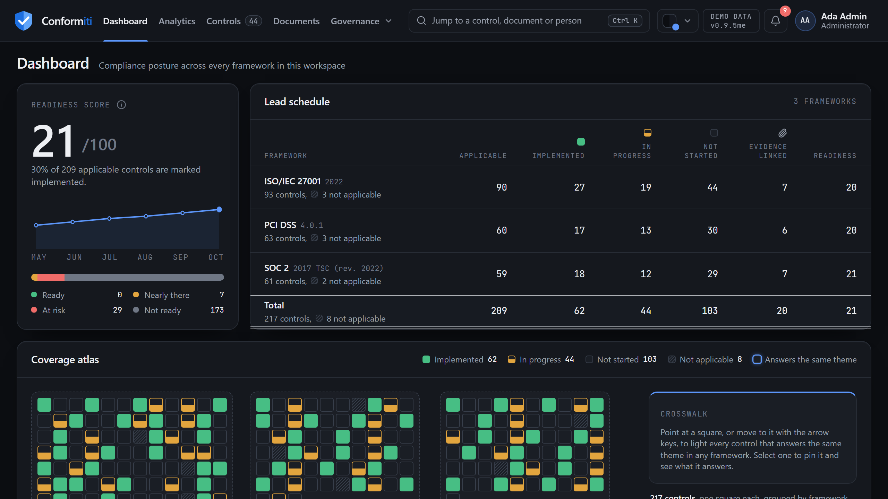

</div>

---

## Contents

<table>
<tr><td valign="top">

**Start here**
- [Quick install](#quick-install)
- [Why this exists](#why-this-exists)
- [What you get](#what-you-get)
- [Day one, in order](#day-one-in-order)

**The product**
- [Frameworks and controls](#frameworks-and-controls)
- [Documents and evidence](#documents-and-evidence)
- [Third parties and shared responsibility](#third-parties-and-shared-responsibility)
- [Governance](#governance)
- [Handing evidence to an auditor](#handing-evidence-to-an-auditor)
- [Security and access](#security-and-access)
- [Workspaces](#workspaces)
- [Notifications](#notifications)

</td><td valign="top">

**Running it**
- [Installation](#installation)
- [Configuration](#configuration)
- [Roles and permissions](#roles-and-permissions)
- [Operations runbook](#operations-runbook)
- [Upgrading](#upgrading)
- [Troubleshooting](#troubleshooting)

**Under the hood**
- [Tech stack](#tech-stack)
- [Architecture](#architecture)
- [The API](#the-api)
- [Quality gates](#quality-gates)
- [Project structure](#project-structure)

**Everything else**
- [FAQ](#faq)
- [Roadmap](#roadmap)
- [Contributing](#contributing)
- [Licence and legal notes](#licence-and-legal-notes)

</td></tr>
</table>

---

## Quick install

<a id="sixty-second-install"></a>

You need git, Docker Engine 24 or newer with Docker Compose 2.24.0 or newer,
and free host ports 8080 and 8000, or others named in `CONFORMITI_PORT` and
`CONFORMITI_API_PORT` ([Requirements](#requirements)).

```bash
git clone https://github.com/dboudreau00/Conformiti.git && cd Conformiti
git checkout "$(git tag --list 'v*' --sort=-v:refname | head -n1)"   # the newest release
docker compose up -d --build
```

`main` is the development line and can carry changes no release has yet, so
installs and upgrades follow release tags. The second line checks out the
newest one and leaves the checkout on a detached HEAD, which is intended
([Upgrading](#upgrading)). In PowerShell it reads
`git checkout (git tag --list 'v*' --sort=-v:refname | Select-Object -First 1)`.

The first build downloads the Python and Node dependencies and takes several
minutes. `up -d` then waits for the API to report healthy before it starts
nginx, so a pause at that point is normal. The prebuilt images below skip the
build.

Then create the first account. The sign-in page cannot make one, so it is
made here. Its password must pass the password policy: at least
`PASSWORD_MIN_LENGTH` characters (12 by default), not a common password, not
all digits, and not too close to the username or email.

```bash
docker compose exec backend python manage.py createsuperuser
```

Open **http://localhost:8080** and sign in with it.

That is the whole install. PostgreSQL, Redis, the API, the reminder worker, its
scheduler and nginx come up with safe defaults for a trial on a trusted
network: `DEBUG` off, a unique secret key generated and persisted on first
boot, rate limits in Redis shared across workers, and the API published only
on the host's loopback so the network sees nothing but nginx. **No `.env` is
required.** It is not a production deployment as it stands. nginx serves plain
HTTP on port 8080, so the session cookies are not marked `Secure` and carry no
`__Host-` prefix, and email is printed to the backend log rather than sent.
The database keeps the default password `compliance` and Redis has none;
neither publishes a port. Passkeys and the in-browser digest need HTTPS, or
`localhost`. Put TLS in front and follow *Going to production* in
[INSTALL.md](INSTALL.md) before real data goes in.

Nothing to build? The same two images are published for `linux/amd64` and
`linux/arm64` at
[ghcr.io/dboudreau00](https://github.com/dboudreau00?tab=packages&repo_name=Conformiti),
and a second compose file runs them. Pull first: `up` on its own reuses any
`latest` an earlier pull left on the machine, which may be an older release.

```bash
docker compose -f docker-compose.yml -f docker-compose.ghcr.yml pull
docker compose -f docker-compose.yml -f docker-compose.ghcr.yml up -d
```

Prefer a script that waits for the stack to report healthy and prints the URLs?
(`install.sh` needs curl for the wait.) Where there is no `.env` it writes one
for a LAN deployment over plain HTTP (`DEBUG` off, email to the log), with no
secret key in it: the container generates its own and keeps it in the
`secrets` volume, as on the plain path above.

```bash
./install.sh --docker                                            # macOS / Linux / WSL
powershell -ExecutionPolicy Bypass -File .\install.ps1 -Docker   # Windows
```

Local development without Docker (SQLite, console email, nothing left running):

```bash
./install.sh                                                     # macOS / Linux / WSL
powershell -ExecutionPolicy Bypass -File .\install.ps1           # Windows
```

On Windows, `-ExecutionPolicy Bypass` applies to that one run and changes
nothing on the machine. Without it, Windows PowerShell's default policy
refuses to run any script, and a script extracted from a downloaded ZIP is
refused under `RemoteSigned` as well.

> **Want the worked example instead of an empty installation?** Put
> `SEED_DEMO_DATA=true` in a `.env` file beside `docker-compose.yml` before
> `docker compose up` for a seeded organisation and five personas sharing one
> generated password, printed once in the backend log
> (`docker compose logs backend`) until that container is recreated (as
> `docker compose up` does after any change to `.env`), so note it. It is
> off by default because
> those accounts have no second factor, and an installation carrying them
> says so on its own sign-in page. Retire them before any real data goes
> in. `remove_demo_data` refuses to run until an administrator of your own
> exists, so create one first:
>
> ```bash
> docker compose exec backend python manage.py createsuperuser
> docker compose exec backend python manage.py remove_demo_data
> ```
>
> The retirement is recorded and holds across restarts, even while `.env`
> still says `SEED_DEMO_DATA=true`.
>
> Full sequence: [Day one, in order](#day-one-in-order).

---

## Why this exists

Most compliance programmes are held together by a control matrix in Excel, a
folder of policies nobody has opened since the last audit, and a heroic effort
in the six weeks before fieldwork. Three things reliably break:

| The question | What usually happens | What Conformiti does |
|---|---|---|
| *"Where is the evidence for CC6.1?"* | Somebody greps a shared drive | Evidence lives in a tree **generated from the control libraries**; every document declares which controls it satisfies, and every control lists its documents |
| *"When was this policy last reviewed?"* | 2023, and nobody noticed | Every document carries a cadence and a next-review date; owners are emailed as the review approaches (30 / 14 / 7 / 1 days by default) and once when overdue, never twice for the same window |
| *"Just give the auditor read access to the drive"* | Access that outlives the engagement | A **sealed, signed package** issued to named auditors for a fixed window: their online access ends on its own, and the bundle they may export verifies offline |

Readiness is *measured*, not drawn. Every applicable control is scored from its
implementation status, owner, evidence, the freshness of that evidence and
testing, less a penalty for open risks. The dashboard leads with that score and
shows the implemented share (**implemented ÷ applicable**) beside it. Its lead
schedule gives each framework its own score and its controls by status, footed
to the programme. The programme's figures are snapshotted daily. Nobody types
a percentage into this system.

There is no telemetry, no phone-home, no licence server, and no seat meter in
the code. It is MIT, and it is meant to be run by the organisation that uses
it.

---

## What you get

<table>
  <tr>
    <td>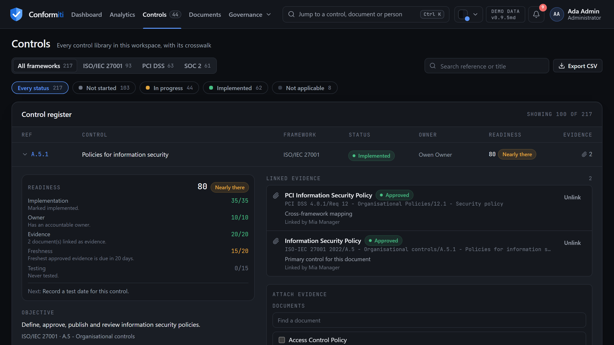</td>
    <td>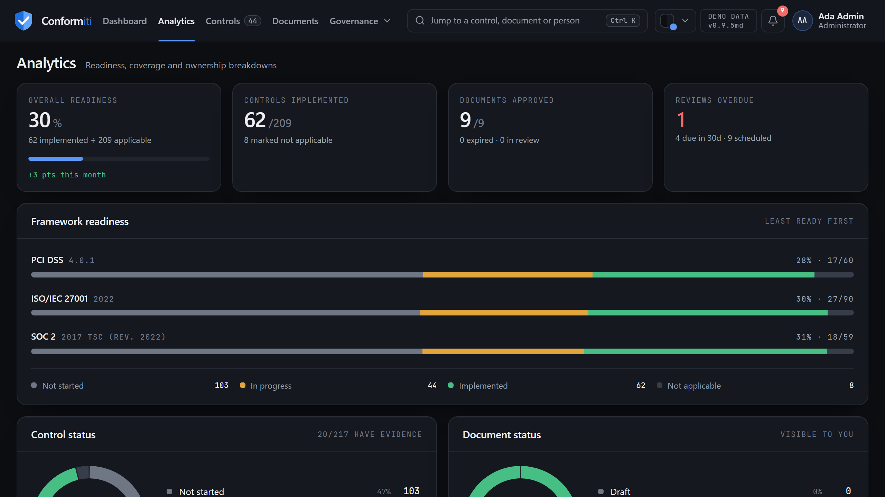</td>
  </tr>
  <tr>
    <td align="center"><sub>217 controls with inline status, owners and linked evidence</sub></td>
    <td align="center"><sub>Framework readiness, status mix, review load and ownership coverage</sub></td>
  </tr>
  <tr>
    <td>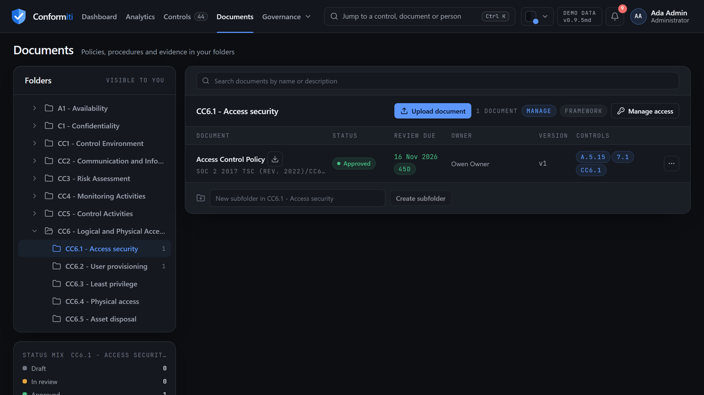</td>
    <td>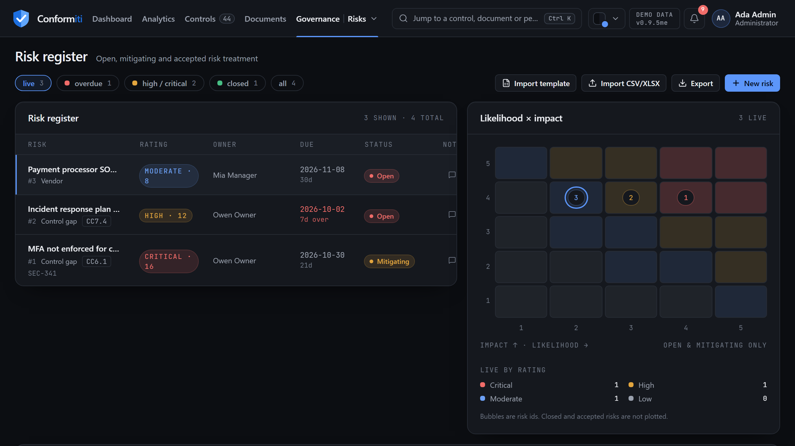</td>
  </tr>
  <tr>
    <td align="center"><sub>Evidence tree segregated by control, review cadences, versions, grants</sub></td>
    <td align="center"><sub>5×5 risk register with treatment, owners, notes and CSV/XLSX import</sub></td>
  </tr>
  <tr>
    <td>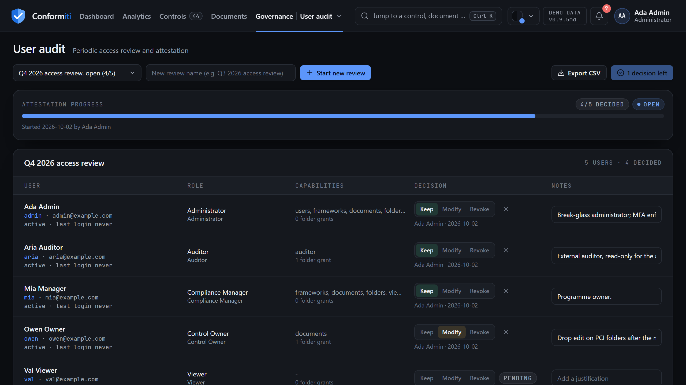</td>
    <td>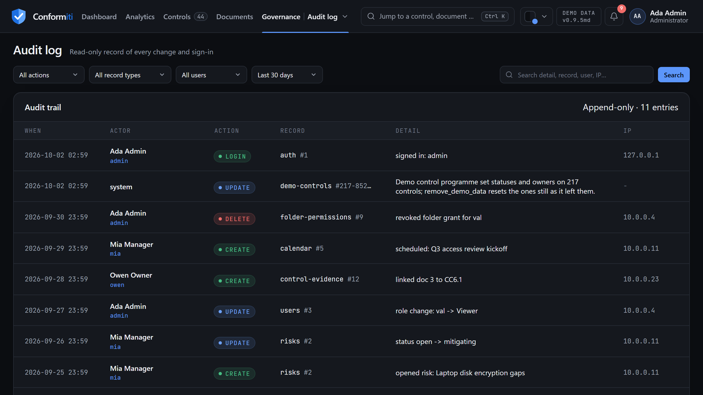</td>
  </tr>
  <tr>
    <td align="center"><sub>Periodic user access reviews exported as audit evidence</sub></td>
    <td align="center"><sub>Read-only trail of every change and sign-in</sub></td>
  </tr>
  <tr>
    <td>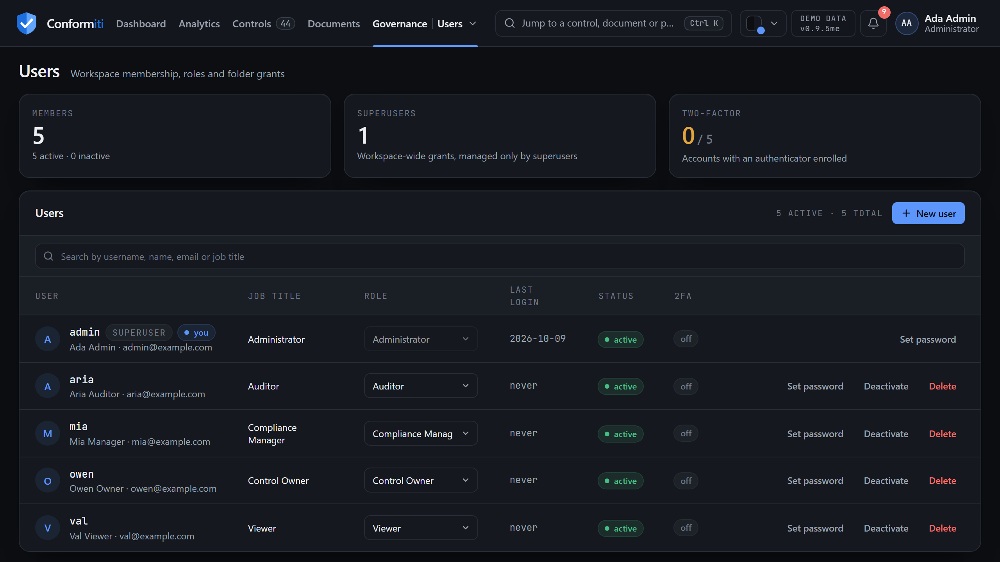</td>
    <td>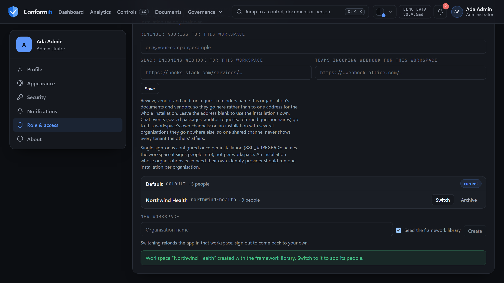</td>
  </tr>
  <tr>
    <td align="center"><sub>Membership, roles, folder grants and who has an authenticator enrolled</sub></td>
    <td align="center"><sub>One installation serving several organisations, scoped at the ORM and switched by a superuser</sub></td>
  </tr>
  <tr>
    <td>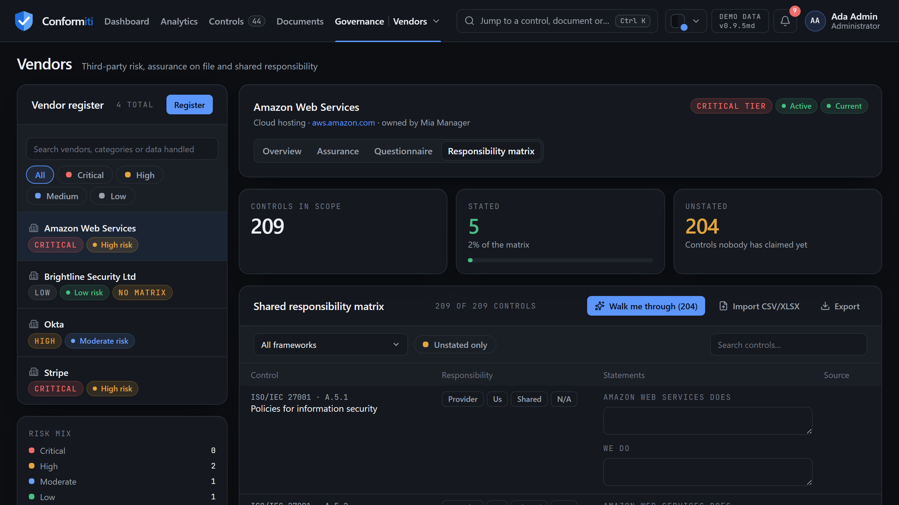</td>
    <td>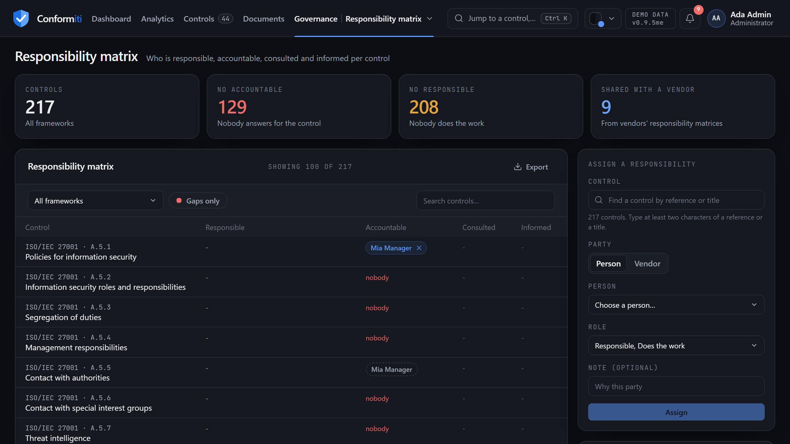</td>
  </tr>
  <tr>
    <td align="center"><sub>Vendors: assurance on file and a shared responsibility matrix, typed, prompted or imported</sub></td>
    <td align="center"><sub>RACI per control, for people and vendors, with the gaps counted</sub></td>
  </tr>
  <tr>
    <td>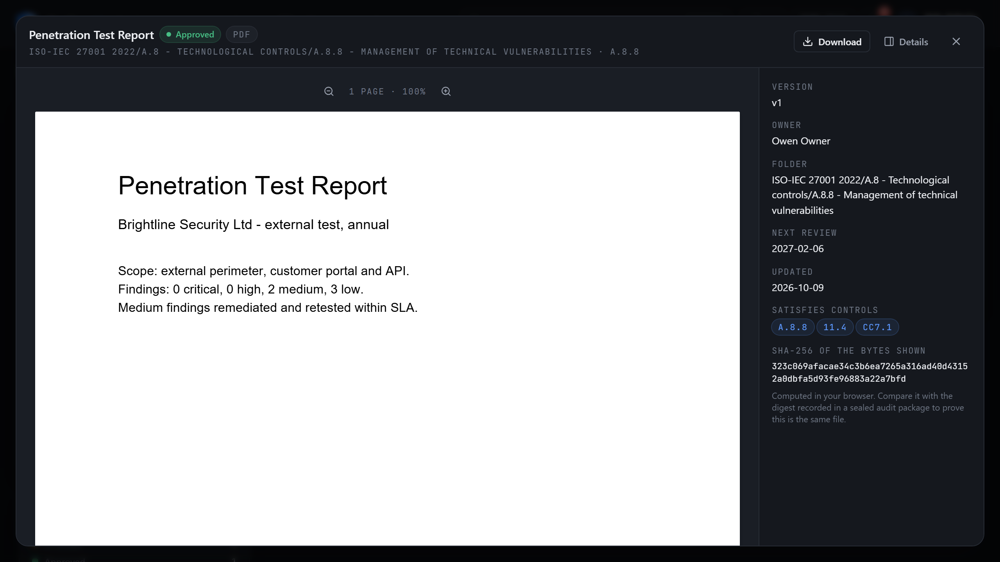</td>
    <td>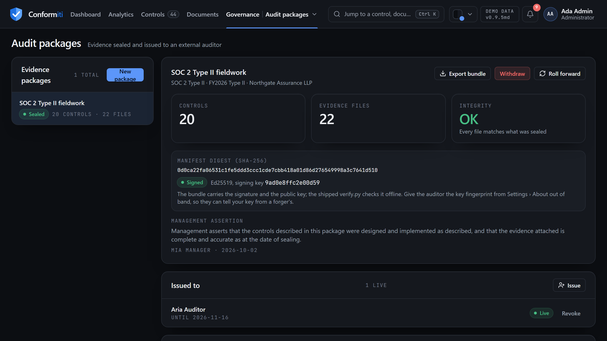</td>
  </tr>
  <tr>
    <td align="center"><sub>PDF, image, Word and Excel evidence opened in the browser, with its digest</sub></td>
    <td align="center"><sub>Sealed evidence packages issued to a named auditor</sub></td>
  </tr>
</table>

### Frameworks and controls

- **Three complete control libraries**: SOC 2 (61), ISO/IEC 27001:2022 (93)
  and PCI DSS v4.0.1 (63), **217 controls** in all, with a cross-framework crosswalk,
  per-control status and owner, and a CSV export of the register.
- **Evidence ↔ control mapping in both directions.** One Access Control Policy
  can satisfy `CC6.1`, `A.5.15` and `7.1` at once; one control can cite many
  documents. Edit the link from either side; bulk-attach during audit prep, and
  the bulk action reports what it skipped and why.
- **A control owner is an account, not a text field.** That is what makes the
  ownership-coverage figure meaningful, what the readiness score counts, and
  what lets the organisation assign a control owner a PBC line they can answer
  without seeing the rest of the audit package.
- **Readiness that is measured.** Daily snapshots feed the dashboard trend and
  the month-over-month delta. Marking a control *not applicable* removes it
  from the denominator. The audit trail records who changed the control's
  status and when, but not the new value, and there is no field for a
  justification: keep the reasoning in a document linked to the control.
- **A lead schedule and a coverage atlas on the dashboard.** The schedule has
  one row per framework (applicable, implemented, in progress and not started
  controls, evidence linked, and the framework's own readiness score) and a
  total that foots to the headline. Below it, every control is one square,
  grouped by framework. Point at a square, or move to it with the arrow keys,
  and every control that answers the same crosswalk theme lights up in every
  framework; select one to pin it and read what else it answers. No lines
  between squares, and status is never colour alone.

### Documents and evidence

- **A folder tree segregated by control**, generated from the libraries
  (framework → category → control), created on disk and mirrored in the app,
  with your own subfolders wherever you want them.
- **Per-folder grants** by role *or* by user at `view` / `edit` / `manage`,
  **inherited down the tree**. Effective access is resolved server-side; the
  interface only offers a write control where the API would accept the write.
- **Document lifecycle**: versions (the old file is archived, not
  overwritten), rename, move, mark-reviewed; review cadences from monthly to
  biennial.
- **Review reminders** emailed to owners and the compliance address at
  configurable lead times, and once when overdue (which also marks the document
  *expired*). Each window is recorded on the document, so a restart does not
  re-send yesterday's mail.
- **Malware scanning** of uploads when ClamAV is configured (new documents
  and new versions, form templates, meeting minutes). While scanning is on it
  fails closed: an upload is refused if clamd cannot be reached. An hourly
  check run by Celery beat emails the compliance address, and posts to chat,
  once when clamd stops answering and once when it answers again. Stored
  files are re-scanned by `manage.py scan_evidence`, which you schedule
  yourself ([INSTALL.md](INSTALL.md#watching-the-malware-scanner) gives a cron
  line). It re-checks the current file of each document (by default those not
  scanned in the last 30 days) and quarantines one that newer definitions
  match. Archived versions, form templates and meeting minutes are scanned on
  upload only.

#### Open in browser

Downloading evidence in order to look at it is how copies of your policies end
up in Downloads folders on laptops you do not control. The viewer renders in
place, and it is deliberately conservative:

| Type | How it is rendered |
|---|---|
| PDF | Drawn by **pdf.js** onto canvases. No plugin frame, no scripting from the file |
| Images | Streamed inline **only after a magic-byte check on the actual bytes**, never on the extension |
| Word, Excel | Parsed on the server into structured JSON and rendered as *structure*. The file's own markup never reaches the page |
| Text (`.txt`, `.md`, `.csv`, `.log`, `.json`) | Shown as plain text, CSV as a grid; never interpreted as markup |
| Anything else | Offered as a download rather than guessed at |

The wrapper shows the version, the controls the document satisfies, and a
**SHA-256 computed in your browser** with WebCrypto: the same digest a sealed
audit package records, so a reviewer can compare by eye. WebCrypto needs HTTPS,
or `localhost`, so over plain HTTP the digest is not offered.

### Third parties and shared responsibility

- **Vendor register** with tier, data handled, owner and a review clock;
  **assurance on file** (SOC 2 reports, ISO certificates, PCI AOCs, pen tests,
  DPAs, a copy of their own responsibility matrix) with expiry tracking.
  Posture and risk rating are **computed** from what is on file and how close
  it is to lapsing, not typed into a dropdown in 2024 and forgotten.
- **The questionnaire, sent to the vendor.** One click emails their contact a
  personal, time-boxed link (14 days by default, 90 maximum, one live link per
  vendor, revocable). They answer in a browser with **no account**; the token is
  stored hashed; the submission returns as a pending assessment marked
  *Returned by …* for you to accept, note exceptions against, or reject.
- **Shared responsibility matrix per vendor**: provider / customer / shared
  with a statement each side, over every control in scope. Type it, be walked
  through the unstated controls, or **import the vendor's own CSV/XLSX**: the
  importer scores headers to find the right columns, promotes a mark column by
  the values inside it, treats the vendor's name or acronym as the provider
  column, requires the framework to be *stated* rather than inferred, and
  **reports prose it does not recognise instead of guessing**. Nothing is
  written until you confirm what it read.
- **Export in their layout**: the stated matrix goes back to the vendor under
  the column headers of the file they sent you.
- **RACI matrix** per control for people *and* vendors, with the control owner
  as implied Accountable and a vendor's matrix as implied Responsible. The API
  refuses a second Accountable on a control, and the controls with none are
  counted and shown. That count is the point.
- **Onboarding prompts** in the notification tray when a vendor has no matrix,
  a report is about to lapse, or a review falls due, plus a **bridge-letter
  reminder**, in the tray and by email, when a SOC report has lapsed with
  nothing newer on file.

### Governance

- **Risk register**: likelihood × impact on the 5×5 grid auditors expect,
  with treatment, owner, due date, optional linked control and Jira key, and a
  note trail anyone with access can add to. CSV/XLSX import that recognises
  the column names and word scales people actually use (Title/Risk,
  Likelihood/Probability, Impact/Severity, *High*, *Likely*, *Almost
  certain*…) and skips duplicates by title. CSV export that round-trips.
- **User access reviews**: snapshot every account as it stands (role, last
  login, folder grants, capabilities) into a keep / modify / revoke decision
  grid, so it cannot shift under you while you work through it. The API refuses
  to complete a review while any row is pending. Completing it deactivates
  every account marked revoke and ends its sessions, except your own account,
  superusers, accounts already inactive and accounts since deleted, which are
  listed for you instead. A completed review is read-only evidence from that
  moment.
- **Meeting cadences** with required-per-year tracking, where the status badge
  compares minutes recorded against what the calendar demands *so far*, so a
  series is not marked behind in January for a meeting due in November.
- **Champion groups** with an accountable owner and members tagged by
  department.
- **Jira** (optional): an administrator connects an Atlassian site (base URL,
  account email, API token, stored server-side and never sent to the browser)
  and tracks boards by id; everyone can then read those boards without a Jira
  seat. `https://` public hosts only, redirects refused, SSRF-hardened.
- **Read-only audit trail**: every change made through the API or saved in
  the Django admin, plus sign-in, failed sign-in (with the reason, a refusal by
  the rate limit included, once per client a minute) and sign-out, with actor,
  record, the field *names* submitted and the client's address (found along
  `X-Forwarded-For` as `NUM_PROXIES` says, as the rate limits find it). The
  submitted values are never recorded, and the keys `password`,
  `current_password`, `new_password`, `api_token`, `otp`, `code` and `secret`
  are dropped before the entry is written. Explicit events carry their own
  facts: a sign-in names the username as typed; turning the authenticator app
  on or off, regenerating backup codes, adding or removing a passkey and a
  password set by an administrator are each recorded; a recorded control test
  shows the old and new dates; and a returned questionnaire names who answered
  it. Nobody edits or deletes an entry, a superuser included: the API has no
  method for it, the Django admin shows the trail read-only, and a workspace,
  which owns its trail, is archived rather than deleted. Someone with direct
  access to the database can still change it, so protect the database and its
  backups, and restrict `/admin/` at your proxy to the people who administer
  the installation.

### Security and access

- **TOTP two-factor auth** and **passkeys / security keys (WebAuthn)**, alone or
  together, with **backup codes owned by the account** so a passkey-only person
  still has a recovery path. A credential whose signature counter regresses
  looks cloned: Conformiti disables it and **refuses the sign-in** rather than
  dropping the account to password-only.
- **HttpOnly cookie sessions by default** with `__Host-` / `__Secure-` prefixes
  derived from the deployment, plus **rotating, revocable refresh tokens** and
  per-client login throttles, shared across workers through Redis wherever
  `CACHE_URL` points at it (the Docker stack sets it; without it each worker
  counts on its own, and the backend warns at boot).
- **Single sign-on over OpenID Connect or SAML 2.0** (Okta, Entra ID, Google
  Workspace, Keycloak…), **configured from the environment only**, so there is no
  form an attacker can reach. Verified-email linking never attaches to an
  administrator, staff or user-managing account; auto-provisioning refuses
  user-managing roles; a domain allow-list applies; the issuer is compared with
  trailing slashes stripped; JWKS verification is asymmetric only.
- **Step-up MFA on SSO logins** (`off`, `if_enrolled` or `required`) for when
  the provider asserted no second factor.
- **Five built-in roles** plus custom roles, folder-level grants, and an API
  that enforces every rule the UI shows.
- Security headers and CSP on by default; uploads size-capped, typed and served
  as sandboxed attachments; field-level encryption (AES-256-GCM) for the TOTP
  seed, the Jira token and each workspace's chat webhook URLs.

### Workspaces

One installation can serve several organisations. Everything an organisation
owns belongs to its **workspace**, and the scoping is applied **at the ORM**:
a queryset carries its workspace filter every time it is chained, so a view
that forgets to scope still cannot leak. A person from one organisation cannot
list, fetch or even reference another's rows.

- A superuser creates workspaces under *Settings › Role & access*, switches
  between them (`X-Workspace: <slug>`; the SPA remembers the choice) and
  **archives** one, which refuses its people at sign-in (superusers excepted),
  rejects the tokens they already held for as long as it stays archived, and
  drops it from every scheduled job. Nothing is deleted.
- Scheduled work runs **once per workspace**: review, vendor and
  auditor-request scans, the daily chat summary, readiness snapshots. Digests
  are computed in the person's own workspace.
- A single-organisation install has one workspace called *Default* holding
  everything it already had, and never notices.
- **Not tenant-scoped, deliberately:** the workspace list itself, per-person
  authentication state (passkeys, TOTP, backup codes, SSO identities), the
  signing-key registry, the scanner status row, notification receipts and
  webhook deliveries. Those belong to the installation or to the individual.
- **Chat channels are per workspace.** A superuser gives each workspace its
  own Slack and Teams webhook under *Settings › Role & access*. They are
  stored encrypted and never returned by the API. An event raised in a
  workspace goes to that workspace's channels. On an installation with more
  than one active workspace, a workspace with no channel of its own posts
  nowhere, unless `WEBHOOKS_SHARED_ACROSS_WORKSPACES=true` sends its events to
  the installation's `SLACK_WEBHOOK_URL` / `TEAMS_WEBHOOK_URL` with the
  workspace name in the title. Installation events, such as the scanner going
  quiet, go to the installation's channels.
- **Single sign-on is one identity provider per installation, by design.**
  `SSO_WORKSPACE` names the one workspace it serves: accounts in it can sign
  in through the provider, and auto-provisioned accounts join it. People in
  other workspaces sign in with a password and their own second factor.

### Notifications

- **The tray** is computed for *you*: documents and risks you own that are due
  or overdue, tasks assigned to you, meeting cadences you own that are behind.
  Managers get org-wide digests; administrators and auditors see open access
  reviews. Opening the tray marks items read; `×` dismisses one.
- **Slack and Microsoft Teams** by incoming webhook: a package sealed, issued or withdrawn; the
  auditor raising a request or returning an answer; a vendor's questionnaire
  coming back; the malware scanner going quiet or recovering; a file
  quarantined; and a **daily summary** of what is outstanding. Slack receives
  Block Kit, Teams an Adaptive Card, and every delivery is logged. A webhook
  URL is a credential, so it is stored encrypted, never returned by the API,
  and may only address a host those services actually issue webhooks on.
  Its host is checked against the allow-list before every post, it is resolved
  and the connection pinned to a public address, and redirects are refused.
  When the server's egress goes through an HTTPS proxy (`HTTPS_PROXY`), the
  proxy does the resolving: the allow-list and the redirect refusal still
  apply, and the proxy is the control for where the post goes.
- **Digest email**: each person can have their own tray sent daily or weekly.

### Interface and identity

One top bar carries the whole interface: the Workspace tabs (Dashboard,
Analytics, Controls, Documents), a **Governance** menu holding the ten
governance pages, search across controls, documents and people (**Ctrl K**, or
**Cmd K** on a Mac), an **Appearance** menu, the notification bell and the
account menu with Settings and Sign out. Each page names itself at its own top.
Under 768 pixels the tabs fold into a **Menu** button that lists every
section.

Four theme packs (Audit Ledger, Nimbus, Ledger Dark, Obsidian), four accent
packs and a custom accent colour, applied before first paint and remembered per
browser. Keyboard-accessible throughout: a *Skip to content* link first, and
every menu opens, moves and closes from the keyboard.

The mark is a shield split along its centreline with one check struck across
it, in four colourways with **fixed meanings**: **Governance Blue** is the
corporate mark; **Assurance Green** means controls passing and audit ready;
**Risk Red** is reserved for findings, escalations and alerts and is never the
lockup; **Policy Purple** stands for frameworks and attestations. Sources in
`assets/brand/` and `frontend/src/brand.js`.

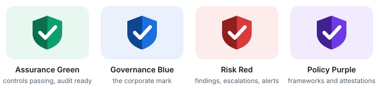

---

## Handing evidence to an auditor

This is the feature the rest of the product exists to feed.

Audit time usually means granting an external assessor read access to a folder
tree and hoping somebody remembers to take it away afterwards. **Audit packages
replace that ritual.**

### The four steps

```
 ASSEMBLE ─────────▶ SEAL ─────────▶ ISSUE ─────────▶ VERIFY
 controls in scope   canonical       one named        sha256sum -c
 evidence pinned     manifest +      auditor, fixed   python3 verify.py
 population stated   Ed25519 sig     window           no vendor involved
 assertion written   audit entry     audited grant    signature checked offline
```

**1 · Assemble.** A compliance manager picks the controls in scope, pins the
evidence for each one, states each control's population (size, source,
sampling method) and may list the items, then writes the management assertion.

**2 · Seal.** Each control is snapshotted when it is added to the draft
(control reference and text, status, owner), and each artefact when it is
pinned (document name, version, size and SHA-256). Sealing re-hashes every
pinned file, refuses if one has changed, and writes those rows into a
**canonical manifest** with its own digest. A status or owner changed after a
control was added is not picked up at seal. The manifest is signed with a
detached **Ed25519** signature from a key held in a file *outside the
database* (`SIGNING_KEY_FILE`). The package freezes: the assessed organisation
can no longer change what the auditor is looking at. A new version of a
pinned document afterwards leaves the package alone: the auditor opens, and
the export carries, the bytes that were sealed. A seal entry goes into
the audit trail, and the key fingerprint is published under *Settings › About*
and at `/api/signing-keys/`.

**3 · Issue.** The package is issued to named auditors, each for a fixed period
(45 days unless you choose another date, 180 at most, both settings). They
sign in with an account holding the Auditor role. Pinned evidence is one of two
deliberate, audited bypasses of the folder-permission model: a live grant
reads every artefact pinned into the package, whatever folder it sits in. The
PBC request list below is the other. What else an Auditor account can read is
set out under [Roles and permissions](#roles-and-permissions). The auditor
records a **design** and an **operating** conclusion per control through the
API, which accepts a conclusion only from an auditor holding a live grant on
the package, so nobody at the assessed organisation can edit them, and you
answer beside them with a management response. The organisation can raise an
exception into the risk register in one click. It arrives as an audit finding
linked to the control, with the auditor's note as its description, and the
package row links to it.

**4 · Verify.** They leave with one self-verifying ZIP:

```
<package name>-<id>.zip
├── manifest.json        canonical, one digest over everything sealed
├── MANIFEST.sha256      that digest
├── manifest.sig         Ed25519 signature over manifest.json, made at seal
├── signing-key.pub      the public key, to compare against the published fingerprint
├── SHA256SUMS           every other file, hashed
├── SHA256SUMS.sig       Ed25519 signature over SHA256SUMS, made at export
├── sums-key.pub         the key that signed SHA256SUMS
├── verify.py            standard library only: no pip install, no network
├── README.txt           what the bundle holds and how to check it
├── INTEGRITY.txt        whether every file matched its sealed digest at export
├── controls.csv         scope, status at seal, both conclusions, management response
├── evidence.csv         name, version, size, digest
├── samples.csv          population, selections, per-item verdicts
├── trail.csv            audit entries about the pinned documents (since the period start, if one is set)
└── evidence/            the files themselves
```

```bash
sha256sum -c SHA256SUMS
python3 verify.py
```

The manifest signature covers what was sealed. The auditor's conclusions are
recorded after the seal, so `controls.csv` and `samples.csv` are covered by
`SHA256SUMS.sig`, which the organisation's key makes when the bundle is
exported. The signature files are present only when the installation has a
signing key, which is the default (`SIGNING_ENABLED=false` turns it off).
`trail.csv` holds at most the first 5000 matching entries, and no IP addresses.

Access to the package expires, or is withdrawn in one click. That ends the
grant, not the account, and not a copy already exported: an Auditor account can
still read the access reviews, the audit trail and any folders granted to it
until you deactivate it, so deactivate it when the engagement ends. The record
of what was disclosed, to whom, and every file they opened, is permanent.

### Sampling

Operating effectiveness is tested on sampled items, so the package holds them.
The organisation states the population while the package is a draft and may
list items; those are sealed into the manifest with the artefact supporting
each one. After sealing, the auditor adds their own selections and records
**pass, exception or not tested** per item, with an exception note that is
required, not optional. The bundle carries the whole workpaper as
`samples.csv`.

### Roll-forward

Next year, roll the package forward: the same controls re-snapshotted as they
stand today with today's evidence pinned, the old package recorded as the
predecessor, and a **year-over-year** panel showing what entered or left scope,
which evidence was replaced, and which of last year's exceptions are still
open. The manifest names its predecessor and that predecessor's manifest
digest, so a chain of engagements can be checked link by link: `verify.py`
prints the predecessor's name and the start of its digest, and the full digest
must equal the sha256 of the earlier bundle's `manifest.json`, which you
compare yourself.

### The PBC request list

The other half of the workflow: what the auditor has asked for. The auditor
raises lines from inside the package (or you transcribe the list they emailed);
each one is assigned, dated and chased (in the tray, by email, and in Slack or
Teams) and answered by attaching documents and marking it *provided*. The
auditor accepts it or returns it with a note. **A control owner with no package
access still sees and answers the lines assigned to them.**

### What the signature proves, and what it does not

> A signature proves that the holder of a key signed a manifest. It cannot
> prove the key was never stolen, and it cannot prove *when* it was signed.
>
> The seal entry in the audit trail, and a digest you publish out of band (an
> email to the assessor, a ticket, a signed message), are the other half of
> that binding. The compose stack keeps the signing key in the `secrets`
> volume on the same host as the database, and `scripts/backup.sh` puts it in
> `secrets.tgz` beside the database dump. Store `secrets.tgz` apart from
> `db.sql.gz` (or encrypt the backup), and publish the fingerprint where your
> auditor can compare it.


---

## Day one, in order

| # | Do this | Why |
|---|---|---|
| 1 | `docker compose up -d --build` | The stack comes up with `DEBUG` off, a generated secret key and only nginx reachable from the network. Set `POSTGRES_PASSWORD` and `REDIS_PASSWORD` in `.env` before the first start: otherwise the database password is `compliance` and Redis has none (neither publishes a port) |
| 2 | `manage.py createsuperuser` | Your first real administrator, with a password that passes the policy (`PASSWORD_MIN_LENGTH`, 12 by default). No demo dataset is seeded unless you asked for one |
| 3 | `manage.py remove_demo_data` (`--delete` to remove rather than deactivate, `--dry-run` to see what it would change) | Only if you did ask: those accounts share one password and have no second factor. It refuses to run until the administrator from step 2 exists, and the retirement holds across restarts even with `SEED_DEMO_DATA=true` still set. It also takes back the demo's control programme: controls a demo account owns are left with no owner, the statuses the demo set go back to *Not started* unless someone changed them since, and the demo's readiness history goes |
| 4 | Set `DJANGO_ALLOWED_HOSTS`, `CSRF_TRUSTED_ORIGINS`, `CORS_ALLOWED_ORIGINS`, `PUBLIC_URL` | The moment you leave `localhost`. `DJANGO_ALLOWED_HOSTS` is your public host name(s); the Docker stack adds its own internal names itself. Sending a vendor questionnaire is refused until `PUBLIC_URL` is set, because the link carries a bearer token |
| 5 | Put TLS in front and set `BEHIND_TLS=true` and `NUM_PROXIES=2` (the terminator and the shipped nginx are two hops) | Secure cookies, HTTPS redirect, `__Host-` prefixes, and rate limits keyed on the real client. The prefix only works over https. Have the terminator set `X-Forwarded-Proto` itself rather than pass on the client's |
| 6 | Configure `EMAIL_PROVIDER`, then send yourself a test: `manage.py test_mailbox --to you@example.com` | Reminders are half the product. It sends a sample review reminder through whichever provider is configured, with the template and transport real reminders use, and with `mailbox` checks the account's sign-in first |
| 7 | Enrol a second factor on every account with a management capability | TOTP or passkeys; backup codes belong to the account |
| 8 | Back up the **secrets** volume | It holds the secret key (the file `DJANGO_SECRET_KEY_FILE` names), the field-encryption ring *and* the package signing key, whether you started with plain `docker compose` or the install script: neither writes a key into `.env` |
| 9 | Restore from a backup once, into a scratch environment | An untested backup is a finding in most frameworks and a disaster in all of them. On the same host, restore into a second checkout whose `.env` sets its own `COMPOSE_PROJECT_NAME`, `CONFORMITI_PORT` and `CONFORMITI_API_PORT`: two checkouts in folders of the same name are one Compose project and share its volumes |

---

## Installation

### Requirements

| Path | Needs |
|---|---|
| **Docker** (recommended) | git, and Docker Engine 24+ with Docker Compose 2.24.0 or newer (older Compose rejects the compose file's optional `.env` entry); curl too for `install.sh --docker`. 2 vCPU / 4 GB RAM / 20 GB disk is comfortable. Host port 8080 free, and 8000 on 127.0.0.1 |
| **Local** (trial, development) | git, Python 3.11 to 3.14 with `venv` and `pip` (Debian/Ubuntu: `sudo apt install python3-venv python3-pip`), Node 20.19+ or 22.12+ (the `nodejs` package of Debian 12 and Ubuntu 22.04 or 24.04 is older: install 22 LTS from NodeSource or nvm). SQLite, console email, nothing to run. Local ports 8000 and 5173 free, or others named in `CONFORMITI_DEV_API_PORT` and `CONFORMITI_DEV_PORT` |
| **Production** | PostgreSQL 16, Redis 7, a TLS-terminating proxy, an SMTP/SES sender, a backup target |
| **Optional** | Amazon S3, ClamAV, an OIDC or SAML IdP, a Slack/Teams webhook, Jira Cloud |

Full detail: [PREREQUISITES.md](PREREQUISITES.md) · [INSTALL.md](INSTALL.md) ·
a guided first hour in [GETTING_STARTED.md](GETTING_STARTED.md).

### Prebuilt images

| Image | Holds |
|---|---|
| `ghcr.io/dboudreau00/conformiti-backend` | Django, Celery and gunicorn: the API, the scheduler and the worker all run from this one image |
| `ghcr.io/dboudreau00/conformiti-frontend` | the built interface, served by nginx, which also fronts the API |

Both are built for `linux/amd64` and `linux/arm64`, so the same tag runs on an
Ampere or Graviton VPS and on an Apple Silicon laptop. Each release is tagged
with its version (`0.9.5mc`), with the first seven characters of the commit it
was built from (`sha-…`), and the newest release also answers to `latest`. The version an image carries
is read out of `backend/config/version.py` at build time, which is the same
string `/api/health/` reports, so a running container cannot claim a version
its code is not.

```bash
docker pull ghcr.io/dboudreau00/conformiti-backend:0.9.5mc
CONFORMITI_VERSION=0.9.5mc docker compose -f docker-compose.yml -f docker-compose.ghcr.yml pull
CONFORMITI_VERSION=0.9.5mc docker compose -f docker-compose.yml -f docker-compose.ghcr.yml up -d
```

`docker-compose.ghcr.yml` only swaps the four built services for the published
images. The environment, the volumes, the healthchecks and the published ports
are the ones in `docker-compose.yml`, so an installation assembled this way
is the same installation. Pin `CONFORMITI_VERSION` in production, and pin it
in `.env`: `latest` moves, and a version given on the command line, as above,
lasts for that one command. Keep both files on every later `up` and `pull`,
or name them once in `.env` with `COMPOSE_FILE` ([INSTALL.md](INSTALL.md#without-a-build-the-published-images)):
a plain `docker compose up -d` reads `docker-compose.yml` alone and builds the
stack from source.

Building from source stays the default path, and the images are built from the
same Dockerfiles by
[`.github/workflows/packages.yml`](.github/workflows/packages.yml), which then
pulls what it pushed and boots it before the run is allowed to pass.

### What comes up

Six containers (`db`, `redis`, `backend`, `worker`, `beat` and `frontend`) and
five volumes. ClamAV joins them, with a `clamdb` volume of its own, only when
the `scanning` profile is started. Two host ports are published:

| Host port | Bound to | What answers | Move it with |
|---|---|---|---|
| 8080 | every interface | nginx: the interface, and the API behind it | `CONFORMITI_PORT` |
| 8000 | 127.0.0.1 only | gunicorn directly, for debugging from the host | `CONFORMITI_API_PORT` |

nginx is the only way in from the network, and it carries the CSP, the
security headers and the 32 MB body cap. Inside its container gunicorn listens
on 0.0.0.0:8000 so that nginx can reach it over the compose network; the host
publish of that port is loopback only, and a request sent to it skips nginx's
headers and body cap, so keep it for debugging.

```
browser ─▶ nginx (frontend, :8080) ─┬─▶ gunicorn (backend, :8000) ─┬─▶ PostgreSQL
                                    │        ▲                     └─▶ Redis (cache + broker)
                                    │        healthcheck /api/health/, and the host's
                                    │        127.0.0.1:8000 for debugging (skips nginx)
                                    ├─ /static from a shared volume; evidence only through the
                                    │  internal /protected-media/ location, after the API has
                                    │  checked access
                                    └─ CSP, security headers, 32 MB body cap
celery beat (the schedule) ─▶ Redis ─▶ celery worker ─▶ PostgreSQL / email
volumes: pgdata · media · static · secrets · tree  (clamdb with the scanning profile)
```

> **Never add `Content-Disposition` in an `X-Accel` location.** nginx passes
> the upstream header through, so adding one produces *two*, and browsers
> refuse the response. The API owns that header. This is called out because it
> was a real bug between 0.3.0 and 0.5.0; if you customise `nginx.conf`, do not
> reintroduce it. The file is built into the frontend image: a source build
> picks up an edit with `docker compose up -d --build`, and the published
> images need the edited file mounted
> ([INSTALL.md](INSTALL.md#without-a-build-the-published-images)).

---

## Configuration

Everything is environment-driven. The compose file carries defaults that suit a
trial on a trusted network, and `.env` overrides most of them. A few are fixed
or renamed on the Docker stack on purpose: set `CONFORMITI_DEBUG`,
`CONFORMITI_SECRET_KEY`, `CONFORMITI_FIELD_ENCRYPTION_KEY` and
`CONFORMITI_SCANNING` there, because `DJANGO_DEBUG`, `DJANGO_SECRET_KEY`,
`DJANGO_FIELD_ENCRYPTION_KEY` and `CLAMAV_ENABLED` in `.env` have no effect on
it. The compose file itself sets the key file paths, the scanner host and
port, the database host and port, the Redis URLs and the cache. Every key is
documented in [`.env.example`](.env.example). The ones that matter most:

### Core

| Setting | Purpose |
|---|---|
| `DJANGO_DEBUG` | Unset, the code defaults to `true`. The Docker image and compose stack run with it off (on Docker it is set with `CONFORMITI_DEBUG`). Every other production installation must set `DJANGO_DEBUG=false` itself |
| `DJANGO_SECRET_KEY` / `DJANGO_SECRET_KEY_FILE` | A strong key, or a path where one is generated and persisted (compose uses the file form on the `secrets` volume, and takes an explicit key from `CONFORMITI_SECRET_KEY`) |
| `DJANGO_ALLOWED_HOSTS`, `CSRF_TRUSTED_ORIGINS`, `CORS_ALLOWED_ORIGINS` | Your real hostname(s) once you leave localhost. `DJANGO_ALLOWED_HOSTS` is your public host name(s): the Docker stack adds its own internal names (`localhost`, `127.0.0.1`, `backend`) itself. Getting these wrong is the most common cause of an install that runs but refuses logins |
| `BEHIND_TLS` | `true` once a TLS-terminating proxy sits in front of nginx. Off by default on Docker; elsewhere it is on whenever `DJANGO_DEBUG` is off, so a bare-metal trial over plain http sets it `false` |
| `NUM_PROXIES` | How many proxies stand in front of the API, which is how the rate limits find the client's address: 1 (default) for the shipped nginx alone, 2 with a TLS terminator in front of it |
| `CACHE_URL` | Where the rate-limit counters live. Compose points it at its own Redis; on bare metal set `redis://localhost:6379/2`, or each gunicorn worker counts separately |
| `PUBLIC_URL` | The address links mailed outside the organisation point at. **Required off DEBUG:** a questionnaire link carries a bearer token, so rather than guess the host from the request, sending is refused until this is set |
| `ORGANISATION_NAME` | Your name in outbound email and on the page a vendor sees |
| `SEED_DEMO_DATA` | `true` to boot with the demo dataset. Off by default: an installation carrying it says so on its own sign-in page |
| `DJANGO_SUPERUSER_USERNAME` / `_PASSWORD` / `_EMAIL` | Docker only: create your first account on first boot. The password must pass the password policy, or no account is created and the backend log says why. Give it a real email address, and remove the password from `.env` once the account exists: it stays in the backend container's environment until you do and recreate the containers |
| `CONFORMITI_PORT`, `CONFORMITI_API_PORT` | Compose only: the host ports for nginx (default 8080, every interface) and for the API (default 8000, 127.0.0.1 only) |
| `CONFORMITI_DEV_PORT`, `CONFORMITI_DEV_API_PORT` | Local development only, read from the shell: the Vite dev server's port (default 5173), and the port `runserver` listens on and Vite proxies the API to (default 8000) |

### Data, storage and mail

| Setting | Purpose |
|---|---|
| `POSTGRES_DB`, `POSTGRES_USER`, `POSTGRES_PASSWORD`, `POSTGRES_HOST`, `POSTGRES_PORT` | PostgreSQL whenever `POSTGRES_DB` is set. Compose sets all five (name, user and password default to `compliance`; the database image applies the password only when it first creates the `pgdata` volume). With `POSTGRES_DB` unset, SQLite at `SQLITE_PATH`, or `backend/db.sqlite3` |
| `EMAIL_PROVIDER` | `console` · `smtp` · `mailbox` (IMAP/POP3 + SMTP, with a copy filed in Sent) · `ses` |
| `REVIEW_SCAN_HOUR`, `REVIEW_ALERT_LEAD_DAYS` | When the daily scan runs; how far ahead it warns (30, 14, 7, 1 by default) |
| `USE_S3`, `AWS_STORAGE_BUCKET_NAME`, `AWS_REGION` | Optional Amazon S3 for evidence instead of the local filesystem (`MEDIA_ROOT`, `backend/media` by default) |
| `MEDIA_INTERNAL` | On whenever `DEBUG` is off: the API checks access and hands each download to nginx with `X-Accel-Redirect`. Set `false` behind any other web server, which would send the file empty |
| `MAX_UPLOAD_MB`, `PASSWORD_MIN_LENGTH`, `THROTTLE_LOGIN` | Upload cap (32 MB default), password policy, per-client login throttle |

### Identity

| Setting | Purpose |
|---|---|
| `OIDC_*` | Issuer, client id/secret, scopes, domain allow-list, auto-provisioning. PKCE; asymmetric JWKS verification only |
| `SAML_*` | IdP entity id, SSO URL and signing certificate (the only trust anchor: no metadata is fetched or read), SP entity id and ACS URL. Assertions are replay-checked; HMAC signature methods are refused |
| `SSO_STEP_UP` | `off` · `if_enrolled` · `required`: whether an SSO sign-in must also present a local second factor |
| `SSO_WORKSPACE` | The one workspace single sign-on serves. Only accounts in it can sign in through the provider (a linked account in any other workspace is refused), email linking searches only it, and auto-provisioned accounts join it. Default `default` |
| `WEBAUTHN_RP_ID`, `WEBAUTHN_ORIGINS`, `WEBAUTHN_RP_NAME`, `WEBAUTHN_USER_VERIFICATION` | **`RP_ID` must be a domain**: browsers refuse an IP address, including `127.0.0.1`. Pin both when a proxy rewrites `Host` |

### Assurance and alerting

| Setting | Purpose |
|---|---|
| `SIGNING_KEY_FILE` / `SIGNING_KEY` | Where the Ed25519 package-signing key lives. In compose: `/app/secrets/package_signing_key`. Rotate with `manage.py rotate_signing_key` |
| `CLAMAV_*` | Point at a clamd instance to scan uploads. Scanning fails closed. Celery beat probes clamd every hour and sends one alert when it stops answering and one when it is back (there is no cron equivalent: `scan_evidence` exits 1 when clamd is unreachable, which a cron job can alert on). Stored files are re-scanned only by `manage.py scan_evidence`, which you schedule yourself on every path ([INSTALL.md](INSTALL.md#watching-the-malware-scanner) gives a cron line). On the Docker stack, turn scanning on with `CONFORMITI_SCANNING=true` and the `scanning` profile; `CLAMAV_ENABLED` in `.env` is ignored there |
| `SLACK_WEBHOOK_URL`, `TEAMS_WEBHOOK_URL` | Installation-wide incoming webhooks. A webhook URL is a credential, so it may only address a host Slack or Teams actually issues them on (`WEBHOOK_ALLOWED_HOSTS_SLACK` / `_TEAMS` to change), its address is checked before every post and a redirect is refused. Each workspace can carry its own under *Settings › Role & access* (Workspace), never readable back through the API; with more than one workspace the installation-wide pair is held back unless `WEBHOOKS_SHARED_ACROSS_WORKSPACES=true` |
| `REDIS_PASSWORD` | Compose only: puts AUTH on the queue, result store and cache. Letters and digits |

---

## Roles and permissions

| Role | Manage users | Manage frameworks | Manage documents | Manage folders | View all | Auditor |
|---|:-:|:-:|:-:|:-:|:-:|:-:|
| Administrator | ✓ | ✓ | ✓ | ✓ | ✓ | - |
| Compliance Manager | - | ✓ | ✓ | ✓ | ✓ | - |
| Control Owner | - | - | ✓ (granted folders) | - | - | - |
| Auditor | - | - | - | - | - (granted folders only, read-only) | ✓ |
| Viewer | - | - | - | - | - | - |

Custom roles are defined from the same capability flags.

**The Auditor role is scoped to the engagement.** It is the one role held by
someone outside the organisation, so reads are refused by default rather than
granted by default: an auditor reaches the packages issued to them, the
workpaper rows and evidence in those packages, their own request list, any
folders granted to them or to the Auditor role, every access review and the
whole audit trail, and nothing else. The access reviews and the audit trail do
not need a live grant, and they show the organisation's staff (names, email
addresses, roles, capabilities, last sign-ins) and the client address recorded
against each entry. Folder grants are not tied to a package: they last until
someone removes them, and a grant to the Auditor role reaches every auditor
account. Deactivate an auditor's account when their engagement ends. The risk
register, the vendor file, the control library, the responsibility matrix, the
meeting minutes, the calendar, the user directory and the analytics summary
all answer `403`. Someone inside the company who needs a read-only view of the
programme wants the **Viewer** role instead.

**Effective folder access.** `Folder.effective_access(user)` returns the
highest of:

1. `manage` if superuser or `role.can_manage_folders`
2. `view` if `role.can_view_all`
3. `manage` if the user owns the folder
4. the strongest `FolderPermission` for the user or their role on **this folder
   or any ancestor** (inheritance)

…then an Auditor role is capped at `view`. Documents inherit their folder's
access; a document owner may edit their own document (unless their role is
Auditor), but deleting it requires `manage` on the folder. Re-parenting
requires `manage` on the folder and `edit` on the destination; the generated
framework folders are immutable through the API.

`documents.access.accessible_folder_ids(user)` resolves the same rules in a
handful of queries and scopes every list, tree, feed, evidence count and
analytics figure.

Demo accounts (retire them): `admin`, `mia`, `owen`, `aria`, `val`, all
sharing the password printed when the demo data was seeded.

---

## Operations runbook

Prefix each command with `docker compose exec backend python` on the Docker
path, or `../.venv/bin/python` from `backend/` locally.

### Scheduled, once per workspace

In Docker, Celery beat runs all of this except `scan_evidence`, which has to go
on cron whatever the path; beat also runs its own hourly scanner probe and
outage alert, which exists only as a beat task. Without Docker, put the
commands on cron.

```bash
manage.py send_review_reminders [--dry-run]   # the review/document scan
manage.py record_readiness                    # today's readiness snapshot
manage.py scan_evidence                       # re-scan stored files; exit 1 on an infection or an unreachable scanner
manage.py send_digests                        # per-person daily/weekly digest
manage.py flushexpiredtokens                  # prune the JWT blacklist
```

`--dry-run` prints what the scan *would* send without sending it, and is worth
running once after any mail configuration change.

### Administration

```bash
manage.py createsuperuser
manage.py seed_frameworks --with-folders --all-workspaces   # idempotent; the container runs this on every boot
manage.py seed_frameworks --roles-only
manage.py remove_demo_data [--delete] [--dry-run] [--workspace <slug>]
manage.py rotate_signing_key                      # new Ed25519 key; old public key stays published
manage.py link_oidc_identity <username> [<subject>]   # link an account to its OIDC identity (--allow-privileged for an administrator)
manage.py test_mailbox --to you@example.com       # sample reminder through EMAIL_PROVIDER (mailbox: sign-in checked first)
```

### Backup: four things, all of them

```bash
scripts/backup.sh                 # → backups/<UTC timestamp>/
scripts/backup.sh /mnt/nightly    # or a directory of your choosing
```

One script, run from the checkout while the Docker stack is up. (It drives
the compose containers, so on bare metal it does not apply: see
[INSTALL.md, Backups on bare metal](INSTALL.md#backups-on-bare-metal).) It
writes the database dump (`db.sql.gz`), the evidence files (`media.tgz`: a
database without these is a manifest of things you no longer have), the
secrets volume (`secrets.tgz`: the Django secret key, the field-encryption
ring that protects enrolled TOTP authenticators, the Jira API token and each
workspace's Slack and Teams webhook URLs, and the package signing key) and the
folder tree on disk (`tree.tgz`). It asks the running containers for the
database credentials and the volume names, so it needs no configuration. Put
it on cron and copy the directory somewhere else; CI runs it, destroys the
installation and restores from it on every push to `main` and on every pull
request.

`secrets.tgz` holds, not encrypted, the keys that protect the rest of the
backup. Keep it apart from `db.sql.gz`, or encrypt the whole directory: anyone
holding both can read the encrypted columns and sign packages as you. With
`USE_S3=true` the evidence lives in the bucket and `media.tgz` does not hold
it: back the bucket up (versioning or replication) as well.

Losing the signing key does **not** invalidate signatures already issued (the
public key travels in every bundle), but you will not be able to sign with the
same identity again, and roll-forward chains will change key. Losing the
field-encryption ring makes enrolled TOTP authenticators, the stored Jira token
and the workspace webhook URLs unreadable; backup codes and passkeys still
work.

### Restore

```bash
scripts/restore.sh backups/<UTC timestamp>
```

On the same machine or a fresh one (clone the same release first). `.env` is
not in the backup, so on a fresh machine write it back from your own records
before the restore: the database and Redis passwords, the host names and
origin lists, `PUBLIC_URL`, the mail settings, and `COMPOSE_PROJECT_NAME` or
the ports if you set them. The application containers are stopped, the
database is emptied and reloaded, the three volumes are replaced from the
archives and the stack is started again. Check `docker compose ps` and `/api/health/` afterwards; the signing
key reported there should be the one you had.

On the published images, the restore stays on them only with `COMPOSE_FILE`
and `CONFORMITI_VERSION` in `.env`
([INSTALL.md](INSTALL.md#without-a-build-the-published-images)), the version
being the release the backup came from (and none exported in the shell, where
it would override `.env`). The script takes no `-f` files, and
without `COMPOSE_FILE` its `docker compose` commands read
`docker-compose.yml` alone and build the stack from the checked-out source.
Without `CONFORMITI_VERSION` the images are `latest`, and the restored
database is migrated to that release with no way back. `.env` is not in the
backup, so on a fresh machine write both into it before restoring.

### Health

`GET /api/health/` is unauthenticated and unthrottled, so container
healthchecks and load balancers can poll it, and anyone who can reach it reads
what it reports. It reports `status` (`ok`, or `degraded` with HTTP 503 when
the database does not answer), `version` (the exact release), `database`,
`demo_accounts`, `first_admin_needed` (true while no active account exists),
`scanning` (the malware scanner: `enabled`, `reachable`, `checked_at`,
`latency_ms`, `down_since`) and `signing` (`enabled`, `algorithm`, `key_id`,
`fingerprint`, `per_workspace`, `error`). Packages are signed with a key
derived for their workspace, and this endpoint answers with no workspace: on
an installation serving one organisation `signing` names that organisation's
key, the one its packages carry; with several, `per_workspace` is true and no
key is named (ask `/api/signing-keys/?workspace=<slug>`). It is what the
container healthcheck uses, it answers plain HTTP even when `BEHIND_TLS`
redirects everything else to https, and it is the first thing to attach to a
bug report.

---

## Upgrading

Upgrade notes for each release, including migration counts and what to budget
for them, are in [CHANGELOG.md](CHANGELOG.md). Installs and upgrades follow
release tags; `main` is the development line. After `git fetch --tags`,
`git tag --list 'v*' --sort=-v:refname` lists the releases, newest first.

```bash
scripts/backup.sh                 # first, always
git fetch --tags && git checkout v0.9.5mc
docker compose pull && docker compose up -d --build
```

Checking out the tag leaves the working copy on a detached HEAD at that
release, which is intended: each upgrade names the release it moves to, where
`git pull` would follow the branch past it.

Local edits to tracked files get in the way. `frontend/nginx.conf` edited for
a larger upload limit is the usual one: when the release changes that file,
`git checkout` stops with *Your local changes to the following files would be
overwritten by checkout*, and when it does not, the edit is carried forward
without a word. `git status` lists them. Put them aside for the checkout and
back afterwards (after the backup, as always):

```bash
git stash
git fetch --tags && git checkout v0.9.5mc
git stash pop                     # settle any conflict it reports, then rebuild
```

Anything installed on top of the checkout that changes its files has to come
off before `git checkout` and go back on afterwards, following its own upgrade
notes.

Running the published images instead? The checkout still matters, because the
compose file and the backup scripts come from it. nginx's configuration does
not: it ships inside the frontend image, unless you mount your own
([INSTALL.md](INSTALL.md#without-a-build-the-published-images)). The upgrade,
with `COMPOSE_FILE` and the `CONFORMITI_VERSION` pin in `.env` as that page
sets them:

```bash
scripts/backup.sh
git fetch --tags && git checkout v0.9.5mc
unset CONFORMITI_VERSION          # an exported pin overrides the one in .env
# In .env, move the pin to the new release: CONFORMITI_VERSION=0.9.5mc
docker compose pull && docker compose up -d
```

Change the pin in `.env`, not on the command line. A version given inline
(`CONFORMITI_VERSION=0.9.5mc docker compose ...`) or exported lasts for that
one command or shell. The next short-form command, an `up -d` after any
`.env` edit or `scripts/restore.sh`, reads the old pin from `.env` again and
puts the previous release's images back on a database the new release has
already migrated. The `unset` is for the opposite case: a `CONFORMITI_VERSION`
still exported in the shell (as the `export` in
[INSTALL.md](INSTALL.md#without-a-build-the-published-images) leaves it, or
one set in a shell profile) overrides `.env`, so moving the pin there changes
nothing and `pull` and `up` stay on the old release while the checkout moves
on. Take it out of the profile too. `docker compose config --images` lists
the images the next `up` will run. Without `COMPOSE_FILE` in `.env`, give both files on each
command (`docker compose -f docker-compose.yml -f docker-compose.ghcr.yml pull`,
then the same with `up -d`). Files named with `-f` replace `COMPOSE_FILE` for
that command, so a third file listed there, such as a
`docker-compose.nginx.yml` mount, has to be named with `-f` too.

The backend container applies the shipped migrations and re-seeds the control
libraries in every workspace at boot, so the two `manage.py` steps earlier
releases asked for are no longer needed; running them is harmless. Re-seeding
puts the shipped title, objective, category and order back on every control
the framework files list, so edits to those fields (possible only in the
Django admin) do not survive a restart. Controls you add yourself are left as
they are.

**0.9.5mc** has no migration. The Django admin no longer adds documents,
document versions or form templates and takes no file, and it shows evidence
packages and completed access reviews read-only. An account moved out of the
Auditor role stops reading the packages issued to it at once. A
`DEMO_PASSWORD` that fails the password policy is refused, and the stack
starts without the demo.
**0.9.5mb** has no migration. Sealing and exporting a package are now held to
`THROTTLE_PACKAGE_WORK` per account, and audit entries find the client along
`X-Forwarded-For` as `NUM_PROXIES` says, so set it as the production section
describes if a TLS terminator sits in front of the shipped nginx.
**0.9.5ma** is one migration (`accounts` 0014), which gives an administrator
made before 0.9.5l with the default address `admin@example.com` the address
`admin@localhost`, so it is no longer taken for the demo administrator.
**0.9.5m** is one migration (`compliance` 0008), which gives every control its
place in the standard's order. **0.9.5l** is two (`accounts` 0013, which
attaches superusers created without a workspace, and `compliance` 0007, a
label). **0.9.5f** is one (`accounts` 0012), which lets a password change, an
administrator's password reset or an MFA reset end the account's live
sessions.

**0.9.5b** is one migration, which encrypts the two per-workspace webhook
columns in place. Two behaviour changes will look like faults if you are not
expecting them: a workspace's webhook URLs are no longer returned by the API,
so the settings screen shows whether a channel is configured rather than its
address, and the demo dataset is no longer seeded, so a rebuilt installation
comes up empty unless you set `SEED_DEMO_DATA=true`.

**0.9.5** adds three small columns in two migrations (a score on each
readiness snapshot, and the two per-workspace webhook addresses) and a `beat`
service to the compose file:
the worker no longer runs the scheduler itself, so `docker compose up -d`
after the checkout is what starts it. **0.9.0** is ten migrations, one per
app: each adds the workspace column, moves every row into the *Default*
workspace and makes the column required, inside one transaction on
PostgreSQL. Budget a few seconds per hundred thousand rows.

---

## Tech stack

| Layer | Technology |
|---|---|
| **Backend** | Python 3.11 to 3.14 · Django 5.2 LTS · Django REST Framework · SimpleJWT |
| **Async** | Celery 5 + Redis: daily reminder scan, vendor and PBC scans, readiness snapshot and chat summary (each once per workspace), digest emails, hourly scanner watch, weekly token pruning |
| **Frontend** | React 19 · React Router 7 · Vite 8 · Tailwind CSS · framer-motion · lucide · pdfjs-dist |
| **Database** | SQLite (local) · PostgreSQL 16 (Docker / production) |
| **Storage** | Local filesystem · Amazon S3 optional |
| **Email** | Console · SMTP · IMAP/POP3 mailbox account · Amazon SES |
| **Crypto** | Ed25519 signatures on sealed manifests and on exported bundles' file lists, checked by a from-scratch, standard-library verifier tested against RFC 8032's first test vector and against the `cryptography` library on fresh keys; AES-256-GCM field encryption for the TOTP secret, the Jira token and the chat webhook URLs; HS256 JWTs signed with the Django secret key; Django's PBKDF2 hashing for passwords and backup codes; TOTP per RFC 6238 (HMAC-SHA1) |

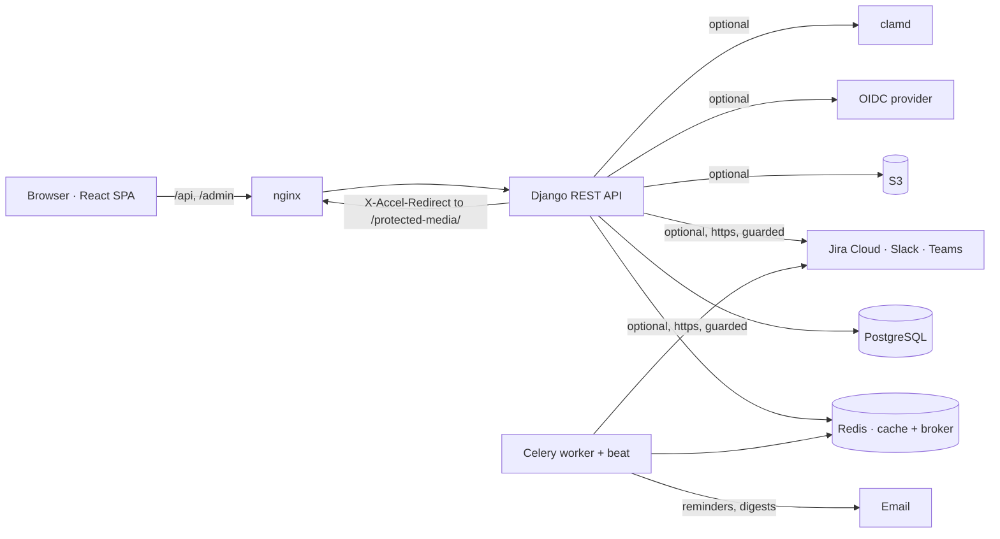
```mermaid
flowchart LR
    U[Browser · React SPA] -->|/api, /admin| N[nginx]
    N --> A[Django REST API]
    A -->|X-Accel-Redirect to /protected-media/| N
    A --> P[(PostgreSQL)]
    A --> R[(Redis · cache + broker)]
    W[Celery worker + beat] --> R
    W -->|reminders, digests| M[Email]
    A -->|optional| S[(S3)]
    A & W -->|optional, https, guarded| H[Jira Cloud · Slack · Teams]
    A -->|optional| I[OIDC provider]
    A -->|optional| C[clamd]
```

Evidence is never read straight off `/media`: nginx refuses client requests to
both media locations, and sends a file only when the API, having checked the
caller's folder grants and written an audit row, answers with
`X-Accel-Redirect`.

---

## Architecture

Deeper notes: [docs/ARCHITECTURE.md](docs/ARCHITECTURE.md).

### Apps

| App | Responsibility |
|---|---|
| `accounts` | Custom `User`, `Role` (capability flags), RBAC permission classes, TOTP MFA + backup codes, passkeys (`webauthn.py` protocol, `passkeys.py` glue), OIDC and SAML SSO, workspaces and the tenancy machinery, sign-out, demo retirement, blacklist pruning |
| `compliance` | `Framework`, `ControlCategory`, `Control`, `ControlMapping` (crosswalk), `ControlEvidence`, `Responsibility` (RACI), the seed and on-disk folder tree, controls CSV export |
| `documents` | `Folder` (self-parent tree with a cycle guard), `FolderPermission`, `Document` (+ scan verdict / quarantine), `DocumentVersion`, upload validation, the clamd client, the scanning boundary and the scanner watch, `preview.py` |
| `governance` | `Risk` + `RiskNote` (+ the CSV/XLSX importer), `AccessReview` + snapshot items, `MeetingSeries` + minutes, `ChampionGroup` + members |
| `vendors` | `Vendor`, `VendorAssessment`, `SharedResponsibility` + the CSV/XLSX recogniser (`matrix.py`), `QuestionnaireInvite` and the public token endpoints |
| `attestations` | `EvidencePackage` → `PackageControl` → `PackageEvidence` / `PackageSample`, `PackageGrant` (the audited folder-permission bypass), manifest and bundle, `PbcRequest` / `PbcItem`, roll-forward and the year-over-year diff, Ed25519 signing and the `SigningKey` registry, the stdlib `verifier.py` shipped in every bundle |
| `notifications` | Reminder scans, email transports, the derived per-user feed with receipts, digest emails, Slack/Teams webhooks with a delivery log |
| `audit` | `AuditLog`, the request middleware, explicit auth events, a read-only viewer API |
| `analytics` | The dashboard summary endpoint, `ReadinessSnapshot` history and trend |
| `calendar_app` | `CalendarEvent` plus the merged review / audit / task feed |
| `integrations` | The Jira Cloud client: https-only, public-IP pinned, no redirects |
| `config` | Settings, URLs, the health endpoint, the version, the CSV sanitiser, field encryption at rest (`fieldcrypto.py`) and the outbound-request guard (`outbound.py`: https only, public addresses only, pinned, no redirects) that the Jira client, the chat webhooks and OIDC share |

### Data model, in essence

```
Framework 1─* ControlCategory 1─* Control *─* ControlMapping
                                    │ 1─* ControlEvidence *─1 Document
User(Role) ─owns→ Control / Folder / Document / Risk

Folder (self-parent tree; framework/category/control FKs on seeded nodes)
   │ 1─* Document 1─* DocumentVersion
   │        └─ owner, review_cadence, next_review_date, reminders_sent,
   │           scan verdict / quarantine
   └─ FolderPermission (role|user → view/edit/manage, inherited downward)

Risk 1─* RiskNote                 AccessReview 1─* AccessReviewItem (snapshot)
MeetingSeries 1─* MeetingMinute   ChampionGroup 1─* GroupMember
CalendarEvent → optional Document / Control / assignee

Vendor 1─* VendorAssessment
   ├─ 1─* SharedResponsibility    (the provider/customer/shared matrix)
   ├─ 1─* Responsibility          (RACI rows, a different relation)
   └─ 1─* QuestionnaireInvite     (token hash only)

EvidencePackage 1─* PackageControl 1─┬─* PackageEvidence
                                     └─* PackageSample
   ├─ 1─* PackageGrant             (the audited bypass)
   ├─ 1─* PbcRequest 1─* PbcItem
   └─ prior_package → the roll-forward chain

AuditLog · ReadinessSnapshot (one per day) · NotificationReceipt (user, key)
MfaDevice 1─* MfaBackupCode · WebAuthnCredential · SigningKey · WebhookDelivery

every model above carries workspace_id and is filtered at the ORM, except:
  NotificationReceipt, MfaDevice, MfaBackupCode, WebAuthnCredential
    (per account, reached through the user),
  SigningKey (a nullable workspace column the key directory filters on),
  WebhookDelivery (installation wide; its log is shown to superusers only)
```

> `Vendor.responsibilities` are the **RACI rows**; the shared-responsibility
> matrix rows are `Vendor.shared_responsibilities`. Confusing the two makes
> every vendor look unstated.

### Tenancy

`accounts.Workspace` is the tenant. Every organisation-owned model inherits
`accounts.tenancy.TenantModel`: a `workspace` foreign key and a manager whose
querysets carry `WHERE workspace_id = <active>` whenever a workspace is active.
The active workspace is a context variable. The per-account security records
(passkeys and their challenges, TOTP devices, backup codes, SSO identities,
notification receipts) and the installation-wide tables (signing keys, SSO
assertion records, the scanner status row, webhook deliveries) do not inherit
it, and are filtered by their views instead.

- `WorkspaceMiddleware` installs a per-request resolver that reads the workspace
  off the authenticated person the *first time a tenant query runs*. DRF
  authenticates inside the view, after middleware, so it has to be lazy. A
  superuser may name another workspace in `X-Workspace`. The variable is
  restored when the request ends.
- Tasks and commands activate one with `tenancy.scoped(ws)` and walk them all
  with `tenancy.for_each_workspace()`.
- A row saved without a workspace takes it from its declared parent
  (`tenant_parent = "folder"`) or from the active workspace, and refuses
  otherwise (`NoActiveWorkspace`).
- The filter is re-applied whenever a queryset is chained, so a queryset built
  at import time (`queryset = Model.objects.all()` on a viewset) is scoped the
  moment DRF calls `.all()`. **Pinning never widens.**
- No active workspace means no filter, which is right for migrations,
  `createsuperuser`, and jobs that walk every workspace. It is also the state
  of every request made without an account: sign-in and single sign-on,
  `/api/health/`, `/api/signing-keys/` and the questionnaire link run with no
  workspace active, so each of those views scopes itself (the questionnaire to
  the invite's workspace, the signing-key directory to the slug it is asked
  for). A signed-in request with nowhere to go is refused with 403.
  `tenancy.unscoped()` is the explicit escape hatch.

### Authentication

- `POST /api/auth/token/` signs in and issues an access token (60 minutes,
  `JWT_ACCESS_MINUTES`) and a refresh token (7 days, `JWT_REFRESH_DAYS`). With
  `AUTH_TRANSPORT=cookie`, the default, both are set as HttpOnly cookies and
  the body is only `{"authenticated": true}`. In that mode the request must
  carry Django's CSRF token in `X-CSRFToken` (`GET /api/auth/config/` sets the
  cookie it comes from), and so must a refresh. With `AUTH_TRANSPORT=header`
  the body carries `access` and `refresh`. Either way an API client may send
  `Authorization: Bearer`. Accounts with a second factor get HTTP 400 with
  `{"mfa_required": true, "factors": {...}, "passkey"?: {...}}` until an `otp`
  (authenticator or backup code) or a `passkey` assertion is supplied; passkey
  challenges live in `WebAuthnChallenge` rows that answer once.
- `POST /api/auth/token/refresh/` rotates the refresh token and blacklists the
  old one. `POST /api/auth/logout/` blacklists the refresh token in its body.
  The interface signs out through `POST /api/auth/token/clear/`, the one
  sign-out route the refresh cookie reaches: it blacklists that token and,
  while the caller is still signed in, every other outstanding refresh token of
  the account. A password change, a password set by an administrator and an MFA
  reset also refuse every access token issued before them.
- Session authentication remains for the Django admin, whose sign-in also asks
  for the second factor of an account that has one. With `DEBUG` on it
  authenticates every API route as well, for the browsable API.
- Sign-in, failed sign-in (with the reason) and sign-out are audit events. A
  sign-out made after the access token has expired revokes the refresh token
  but is not recorded.

### Review-alert flow

```
Document.last_reviewed + cadence ─▶ next_review_date
        │
   daily scan at REVIEW_SCAN_HOUR (Celery beat), or cron: send_review_reminders
        │
   for each document, the most urgent lead in REVIEW_ALERT_LEAD_DAYS (30,14,7,1)
   it has entered and not yet been sent (one email per document per run):
        claim the leads in Document.reminders_sent first (a conditional
        update, so two runs cannot both send; handed back if the send fails)
        └▶ email_service.send_templated_email()
              ├─ EMAIL_PROVIDER=ses     → boto3
              ├─ EMAIL_PROVIDER=mailbox → SMTP (+ IMAP Sent copy)
              ├─ EMAIL_PROVIDER=smtp    → Django SMTP backend
              └─ EMAIL_PROVIDER=console → stdout
        │
   overdue → one notice + status=expired
```

### Audit trail

`audit.middleware.AuditLogMiddleware` reads the top-level field *names* of a
JSON/form body **before** the view runs (values are never recorded, and the
keys `password`, `current_password`, `new_password`, `api_token`, `otp`, `code`
and `secret` are dropped), then, after a successful mutating
response, writes `{user, action, object_type, object_id, "METHOD /path
fields=a,b", ip}`. `/api/auth/*`, `/api/notifications/*` and `/api/health/` are
excluded; auth events are written explicitly by `audit.events`.

### Frontend

A React SPA on Vite. `App.jsx` mounts the shell (one `TopBar` with its
Governance, Appearance and account menus and the search palette, a `SideMenu`
drawn only for navigation sections the core does not define, and
`ShellContext` with the signed-in user, health record and live badge counts)
and the routes; every page is a `PanelTransition` panel, which also draws the
page's title, built from the primitives in `components/ui` (menus and popovers
are the one `Popover`) and `components/charts`. Styling is Tailwind over
the token system in `styles/index.css`: a theme pack (`data-theme`) and an
accent pack or custom colour (`data-accent`) on `<html>`, applied before first
paint by `public/theme-init.js`. In header mode the axios client attaches the
access token from `localStorage`, refreshes once on a 401 (storing the rotated
refresh token) and revokes it on sign-out. In cookie mode, the default, it
stores no token: the browser sends the HttpOnly cookies, the client adds
Django's CSRF token to every unsafe request, a 401 triggers one refresh
through the refresh cookie, and sign-out goes through `/api/auth/token/clear/`.

---

## The API

Django REST Framework, with the SPA as its first consumer. Anything the
interface can do, a script can do, under the same permission checks, and
writing the same audit-trail entries.

| Endpoint | Purpose |
|---|---|
| `/api/frameworks/` · `/api/controls/` | The libraries, statuses, owners, the crosswalk, CSV export; `/api/controls/atlas/` (read-only) is every control with its score and the crosswalk themes, for the dashboard's coverage atlas |
| `/api/folders/` · `/api/documents/` | The evidence tree, uploads, versions, review marking, permission grants |
| `/api/documents/{id}/preview/` | Grant-gated, audited render for the in-browser viewer |
| `/api/risks/` · `/api/risk-notes/` | The register, the note trail, the CSV/XLSX importer |
| `/api/access-reviews/` | Snapshot creation, per-row decisions, CSV export, completion |
| `/api/vendors/` · `/api/vendor-assessments/` | Register and assessments; `/api/vendors/{id}/matrix/` GET, PUT (bulk, validated before write), `matrix/parse`, `matrix/export` |
| `/api/questionnaire/<token>/` | Public, token-scoped, separately throttled: what a vendor answers with no account |
| `/api/evidence-packages/` · `/api/package-controls/` · `/api/package-evidence/` · `/api/package-grants/` · `/api/package-samples/` | Assembly, sealing, withdrawal, manifest, bundle; issuing to an auditor (grants); per-sample verdicts |
| `/api/pbc-requests/` · `/api/pbc-items/` | The auditor's request list: provide, accept, return, withdraw, export |
| `/api/signing-keys/` | Published Ed25519 public keys and fingerprints |
| `/api/workspaces/` | List, create, patch, `current` |
| `/api/audit-log/` · `/api/notifications/` · `/api/analytics/summary/` | The read-only trail, the derived feed with receipts, the dashboard summary (with each framework's counts, evidence linked and readiness score) |
| `/api/health/` | Status, version, database, demo accounts, whether a first administrator is needed, the scanner, the signing key |

Every other route needs a signed-in account. These answer without one:
`/api/health/` (not rate limited; it reports the exact version, whether demo
accounts or a first administrator are pending, the scanner state and the
signing key's id and fingerprint), `/api/signing-keys/`, `/api/auth/config/`,
`/api/auth/session/` and the two sign-out routes, the sign-in and refresh
endpoints, the OIDC and SAML endpoints under `/api/auth/`, and
`/api/questionnaire/<token>/`.

Every list is scoped to the caller's workspace at the queryset level, so a view
that forgets that filter still cannot return another organisation's rows.
Folder grants are applied by each view that returns folders, documents or
records linked to a document, through `documents.access.accessible_folder_ids`
in its own `get_queryset`. A new view that reads documents has to apply it as
well.

---

## Quality gates

Everything in the badge row runs on every push to `main` and on every pull
request. The core of it runs locally with one command:

```bash
./install.sh --test                                              # macOS / Linux / WSL
powershell -ExecutionPolicy Bypass -File .\install.ps1 -Test     # Windows
```

That runs the static validator, the Django system check, the migration
completeness check, the backend suite on your Python with SQLite, and a
production frontend build. The PostgreSQL job, `npm audit`, the Docker and
compose jobs, the installer jobs and the end-to-end suite run in CI; the
end-to-end suite also runs locally with `npm test` in `e2e/`
([e2e/README.md](e2e/README.md)).

| Gate | What it proves |
|---|---|
| `tools/validate.py`: **20 static checks** | App and route wiring, the API contract between the SPA and the backend, that every app with models ships an initial migration and that no install path runs `makemigrations`, theme packs, tests and CI present, one release version wherever it is written, and no em or en dashes in the Markdown docs and the email templates. Runs on a **bare Python interpreter** so a missing package cannot defeat it |
| `manage.py test` | Workspace isolation, auth, MFA, token rotation, the auditor's reachable surface enumerated by walking the routers, RBAC and tree integrity, evidence RBAC, access reviews, risk import/export safety, the audit trail, reminder claims, outbound request checks, field encryption and key rotation, health, demo retirement, the boot guard, WebAuthn against virtual authenticators, SAML against locally signed assertions, Ed25519 against an RFC 8032 test vector and the `cryptography` library. The suite runs with `DJANGO_DEBUG=true`; settings that change with DEBUG are tested where a test overrides them, and the compose job runs the production defaults |
| Backend matrix | Python 3.11 / 3.12 / 3.13 / 3.14 on SQLite, plus PostgreSQL 16. Each SQLite run also executes `manage.py makemigrations --check --dry-run`, which fails the job when a model change has no shipped migration |
| Frontend | A production build that must succeed, plus `npm audit --audit-level=high` |
| Docker | Both images build; the API image boots and answers `/api/health/`. The compose job also signs in through nginx, uploads, downloads through X-Accel, backs up, destroys the stack and restores it |
| [End-to-end](e2e/README.md) | Playwright drives the **built** SPA in a real browser through every screen, against *both* auth transports, and fails on any console error. It runs the backend with `DJANGO_DEBUG=true`, the rate limits raised to 1000 a minute and non-Secure cookies |

The reviews this product has been through, internal and independent (findings,
severities, fixes and what was deliberately left alone), are recorded in
[REVIEWS.md](REVIEWS.md). The 0.9.4 source review and the 0.9.5k code review
are recorded in [CHANGELOG.md](CHANGELOG.md). Operator-facing posture and
residual risks: [SECURITY.md](SECURITY.md). How the gates run:
[TESTING.md](TESTING.md) and [VALIDATION.md](VALIDATION.md).

---

## Troubleshooting

Symptoms and fixes are collected in one place, with the install steps they belong to:
[INSTALL.md](INSTALL.md#troubleshooting). The two most common are a hostname missing from
`DJANGO_ALLOWED_HOSTS` / `CSRF_TRUSTED_ORIGINS` / `CORS_ALLOWED_ORIGINS`, and
`BEHIND_TLS=true` on a deployment still served over plain HTTP.

---

## Project structure

```
conformiti/
├── backend/            Django project (config/) + apps: accounts, compliance,
│                       documents, governance, vendors, attestations, notifications,
│                       audit, analytics, calendar_app, integrations
│                       · testutils.py · Dockerfile · entrypoint.sh
├── frontend/           React SPA (src/pages, src/components, src/styles,
│                       src/brand.js) · Dockerfile · nginx.conf
├── e2e/                Playwright suite, both auth transports
├── compliance-data/    the generated evidence folder tree (segregated by control)
├── docs/               ARCHITECTURE.md · EXECUTIVE_SUMMARY.md · sample-risk-import.csv
├── assets/             brand/ (logo, mark, colourways) · screenshots/
├── scripts/            backup.sh · restore.sh (database, media, secrets and tree volumes)
├── docker/             clamd.conf (the scanner's size limits, kept in step with CLAMAV_MAX_MB)
├── tools/validate.py   the dependency-free static validator
├── .github/workflows   ci.yml · packages.yml (the images on ghcr.io)
├── docker-compose.yml  db · redis · backend · worker · beat · frontend
│                       (+ clamav under the scanning profile)
├── docker-compose.ghcr.yml  the same stack, from the published images
└── install.sh / install.ps1
```

Documents in the root: [INSTALL.md](INSTALL.md) ·
[PREREQUISITES.md](PREREQUISITES.md) ·
[GETTING_STARTED.md](GETTING_STARTED.md) · [USER_GUIDE.md](USER_GUIDE.md) ·
[SECURITY.md](SECURITY.md) · [REVIEWS.md](REVIEWS.md) ·
[TESTING.md](TESTING.md) · [VALIDATION.md](VALIDATION.md) ·
[CHANGELOG.md](CHANGELOG.md) · [ROADMAP.md](ROADMAP.md) ·
[CONTRIBUTING.md](CONTRIBUTING.md)

---

## FAQ

<details>
<summary><strong>Will an auditor accept evidence from a tool I host myself?</strong></summary>

Auditors accept evidence; the tool is not the evidence. What matters is that
the artefact is attributable, complete and unaltered between the moment you
produced it and the moment they read it. An exported package carries the sealed
manifest, a SHA-256 for every file, an Ed25519 signature over the manifest and
another over the file list (when a signing key is configured, which it is by
default), an audit-trail extract, and a standard-library `verify.py`. The
public key and the script travel inside the bundle, so on their own they show
the bundle is consistent, not who made it. Give your assessor the key
fingerprint (*Settings › About*, or `GET /api/signing-keys/`, with
`?workspace=<slug>` on an installation that serves several workspaces) or the
manifest digest by another channel. They can then check the bundle against it
on their own machine, with `sha256sum` and `openssl` if their policy does not
allow running a script from a client.

Tell your assessor early that you will hand them a bundle rather than drive
access. Most welcome it, and the ones who do not can still read the CSVs.
</details>

<details>
<summary><strong>Does it generate policies with AI?</strong></summary>

No, deliberately. Conformiti ships control libraries, an evidence model and the
machinery to prove what you did. It does not generate policy text you would
then have to defend in a walkthrough as your own.
</details>

<details>
<summary><strong>How small a team is this useful for?</strong></summary>

The smallest useful deployment is one person preparing for a first SOC 2 Type
I: the folder tree and reminder engine pay for themselves immediately. It
scales up through a compliance function with control owners spread across
engineering, HR and finance, and up again through workspaces to an MSP or a
group holding several regulated entities on one installation.
</details>

<details>
<summary><strong>Which frameworks ship, and what about the others?</strong></summary>

SOC 2, ISO/IEC 27001:2022 and PCI DSS v4.0.1 ship in this repository, free,
with a crosswalk between them. Additional framework libraries (NIST CSF 2.0,
HIPAA, CIS Controls v8 and others) are not part of this edition; see
[conformiti.app](https://conformiti.app/consulting.html#seed-packs) for what is
offered around it. `seed_frameworks` loads the three files shipped in
`backend/compliance/data`, and custom controls can be added in the Django
admin.
</details>

<details>
<summary><strong>Can I get my data out?</strong></summary>

It was never anywhere else: a PostgreSQL database and a directory of files,
both yours. Nothing in this repository calls home, and every export in the
product (controls CSV, risk CSV, access-review CSV, the audit package bundle)
is a plain file format.
</details>

<details>
<summary><strong>Is there commercial support?</strong></summary>

Yes. Support subscriptions, a managed cloud, and consulting are offered at
[conformiti.app](https://conformiti.app); see there for what is offered around
this repository. None of it changes this repository or its licence.
</details>

---

## Roadmap

**0.9.5 is the last version number, and the feature-complete release of the
open-source edition.** What the repository set out to be, a self-hosted
programme of record for SOC 2, ISO 27001 and PCI DSS with sealed and signed
audit packages, vendor risk, workspaces and the operations to run it, is here,
and every finding of the independent reviews recorded under
[Quality gates](#quality-gates) is fixed or written down as deliberately left
alone.

Releases after it are revision letters on that number: 0.9.5b, then c, d and
so on. Each is maintenance: security and defect fixes, dependency updates and
compatibility with new Python, Django and PostgreSQL versions, for as long as
people run it. A revision can still carry a migration or change a behaviour,
and its entry in [CHANGELOG.md](CHANGELOG.md) says so before you upgrade.
[ROADMAP.md](ROADMAP.md) has the release-by-release history.

Automated evidence collection from cloud and SaaS accounts, additional
framework libraries (NIST CSF 2.0, HIPAA, CIS Controls v8) and the like are
not planned for this edition; see [conformiti.app](https://conformiti.app)
for what is offered around it.

---

## Contributing

See [CONTRIBUTING.md](CONTRIBUTING.md). In short:

- Run the gates before opening a pull request: `./install.sh --test`
  (Windows: `powershell -ExecutionPolicy Bypass -File .\install.ps1 -Test`).
- Model changes need a shipped migration: the backend CI job runs
  `manage.py makemigrations --check --dry-run` and fails without one, and
  `./install.sh --test` runs the same check. `tools/validate.py` separately
  refuses an app with models and no initial migration, and any install path
  that runs `makemigrations`.
- Validator checks must be **standard library only**; the CI `validate` job
  installs nothing.
- Security issues go to the private advisory route, not a public issue. See
  [SECURITY.md](SECURITY.md).

---

## Licence and legal notes

[MIT](LICENSE) © 2026 elemosecurity.

> **Control text and copyright.** Control identifiers and short titles are
> functional identifiers. The `objective` fields shipped in the seed packs are
> brief **original paraphrases**, not the normative text of SOC 2, ISO/IEC
> 27001 or PCI DSS. Only paste official control text into the app if your
> organisation holds a licence for the source documents; the responsibility is
> yours. The objective of a shipped control is read-only in the interface and
> the API, and seeding, which the Docker entrypoint runs at every start,
> replaces it with the shipped paraphrase. Licensed text therefore belongs on
> controls you add yourself in the Django admin, or in your evidence
> documents.

> **Not affiliated** with the AICPA, ISO, the IEC or the PCI Security Standards
> Council. Framework names are used to describe what the control libraries
> cover.

<div align="center">

**[conformiti.app](https://conformiti.app)** · [Product tour](https://conformiti.app/product.html) · [Self-hosting guide](https://conformiti.app/self-host.html) · [Security](https://conformiti.app/security.html)

</div>
